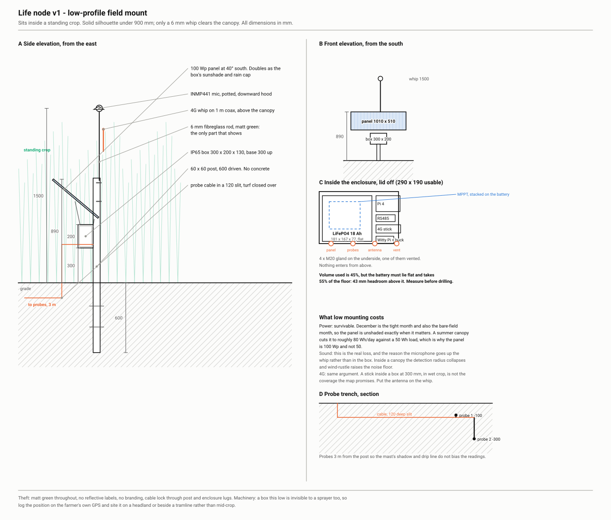
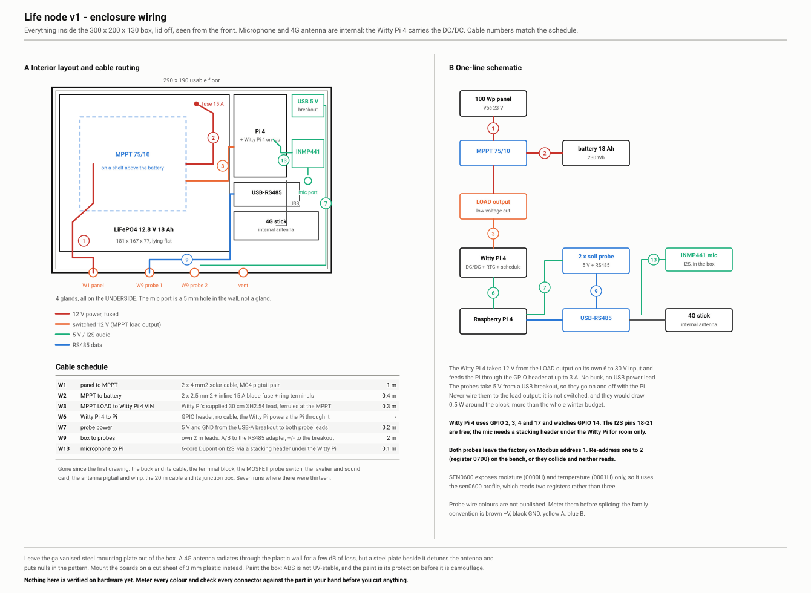
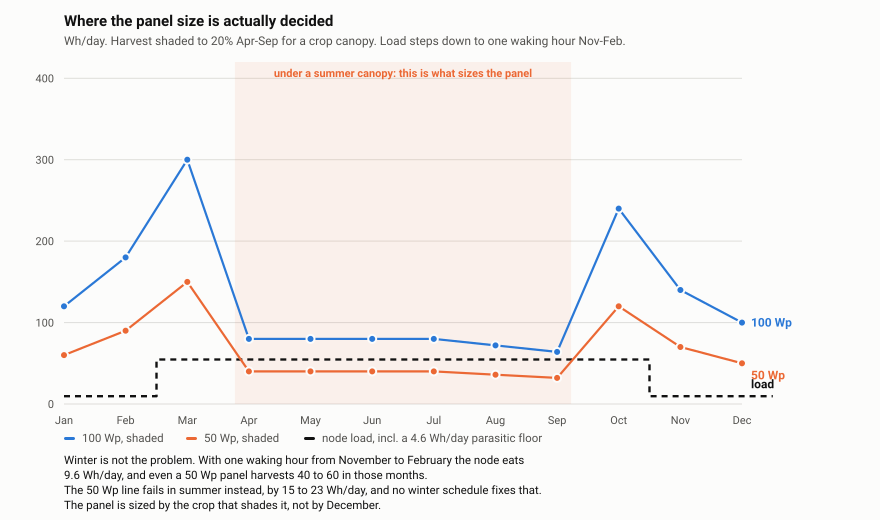

# The kit: Life node v1

One box, one post, one radio. A landowner gets a sealed enclosure with a solar panel and two probe cables. They drive in a post, hang the box, push the probes into the ground. Everything else was done before it shipped. Prices and stock checked on live shop pages, most recently on 2026-09-16, when the first set was ordered. Incl. VAT unless a line says otherwise. The order list in the repository is the source of truth; this table is a description of it.

*An impression of the design, not a photograph. The kit is designed and ordered; nothing has been built yet, and the [build plan](build.md) says where that stands. What the picture is right about is the shape and the size: one box the size of a shoebox at knee height, one panel above it doing the work of a roof, one post, two leads into the ground, and nothing else. The skylark, the hare and the bees are the point of the whole exercise rather than decoration: they are what the node is there to notice, and the bird on the panel is the one that ends up in the Diversity reading.*

## Why one box

The first set had three radios (WiFi to the recorder, LoRaWAN to the probes, the farm's internet for both), two hubs (an access point on the barn, a gateway on the window sill), and a dependence on the farm network reaching the field. It was €1,110. Most fields are not within WiFi reach of a barn, and every extra device is a thing that can be unplugged.

The node folds all of it into one enclosure:

- a small computer runs BirdNET locally, so only detections leave the field (a few kilobytes a day, which is why a €12 ten-year IoT SIM is enough);
- the soil probes are wired into the same box on their own 2 m leads, so they need no radio and no battery of their own;
- one 4G/LTE-M modem carries everything; the landowner's network is never involved;
- one solar panel and one battery power the lot.

## What is in the box

| # | Part | Choice | Supplier | Price |
| --- | --- | --- | --- | --- |
| 1 | Computer | Raspberry Pi 4 Model B, 2 GB, runs BirdNET-Go | Berrybase | €57.90 |
| 2 | Storage | SanDisk High Endurance 32 GB microSD, continuous-write rated | Berrybase | €28.60 |
| 3 | Modem | Brovi/Huawei E3372-325 USB 4G stick, plug-and-play as a USB ethernet device | TelecomShop | €53.55 |
| 4 | SIM | 1NCE IoT Lifetime Flat, 500 MB, 10 years | 1nce.com | €12 |
| 5 | Microphone | INMP441 I2S MEMS module, inside the box behind a 5 mm port | Berrybase | €3.10 |
| 6 | Microphone port | IP67 ePTFE acoustic membrane, under 2 dB loss at 1 to 5 kHz, plus a foam-lined hood | PCB Artists / bouwmarkt | ~€19 |
| 7 | Soil probes ×2 | DFRobot SEN0600 RS485 moisture + temperature, stainless, IP68, each on its own 2 m lead | Berrybase | 2 × €26.90 = €53.80 |
| 8 | RS485 adapter | Waveshare industrial USB to RS485, FT232RL, surge and ESD protected | Berrybase | €12.90 |
| 9 | Probe power | USB-A socket to terminal block, so the probes run off the Pi and stop when it does | Berrybase | €8.90 |
| 10 | Solar panel | Enjoy Solar 100 W 12 V mono, anodised aluminium frame, 1190 × 540 mm, ships with 90 cm MC4 leads so no separate cable is needed | Accuweb (NL) | €85.00 |
| 11 | Battery | LiFePO4 12.8 V 20 Ah, 256 Wh, 181 × 76 × 170 mm, M5 terminals | reichelt | €82.16 + €8.47 hazardous-goods surcharge |
| 12 | Charge controller | Victron SmartSolar MPPT 75/10, load output, LiFePO4 preset | reichelt | €64.89 |
| 13 | Scheduler + DC/DC | Witty Pi 4: RTC, scheduled boot and shutdown, and a 6 to 30 V converter feeding the Pi at up to 3 A, so there is no separate buck | UUGear | €35.11 |
| 14 | Enclosure | IP65 ABS box 300×200×130 mm, painted matt green (the paint is its UV protection; a polycarbonate Spelsberg AKi at ~€98 is the ten-year box) | reichelt | €32.49 |
| 15 | Cable glands ×5 | M20, IP68: panel, two probe leads, one vented, one spare | reichelt | €5.05 |
| 16 | Mounting plate | 3 mm plastic sheet cut to the box, replacing the galvanised steel plate it ships with | bouwmarkt | ~€5 |
| 17 | Board protection | Nylon M2.5 spacers and acrylic protective lacquer, instead of silica gel nobody regenerates | Berrybase | €18.80 |
| 18 | Terminations | Ferrule assortment, crimping pliers, heatshrink, UV ties, stacking header | Berrybase | €25.45 |
| 19 | Battery lead | 2 × 2.5 mm² with ring terminals and an inline 15 A fuse | bouwmarkt | ~€8 |
| 20 | Post and mount | 2 m post, pressure-treated class 4, two stainless clamps, M8 through-bolts for the panel brackets, cable lock, spade | bouwmarkt | ~€55 |
| 21 | Meter | USB inline power meter, to measure the one number this whole design rests on | Amazon / Opencircuit | ~€15 |

> **Where you buy the panel and battery matters more than what they cost.** Offgridtec in Germany quoted **€232.90 of shipping on €88.30 of goods**: a hazardous-goods rate for the lithium battery plus freight for a bulky panel, crossing a border. Buying the same two things in the Netherlands and from reichelt costs more in parts and about €145 less delivered. Cheap parts behind expensive freight are not cheap.

**Parts total: about €687** for one node, of which roughly €490 is verified against a live shop page and the rest estimated, plus about €30 of postage across the shops. The earlier distributed set was €1,110.

## How it is mounted

A node in an arable field has two predators: people who take things, and the sprayer that never saw it. Both are answered by the same choice, which is to keep the solid part of the node below the crop and put only a 6 mm rod above it.

*The same design in June wheat, and the reason for every dimension below: at 1090 mm nothing stands above the crop. An impression, not a photograph.*

Nothing stands higher than 1090 mm, and nothing sticks up at all. The enclosure sits at 500 mm above grade, clear of splash and standing water, on a 60 x 60 post driven 800 mm with no concrete and no spoil heap to mark the spot. The 500 mm is a deliberate compromise: every 100 mm of height helps both the microphone and the radio, and a panel whose top edge is at 1090 mm still disappears in wheat or maize. It is not free, because the panel is a half-square-metre sail. At 25 m/s it pushes about 170 N sideways, and moving the box up from 300 to 500 mm raises the overturning moment at ground level from roughly 120 to 155 Nm, which is why the post goes 800 mm down rather than 600. Push hard on the post after driving it: if it moves, go deeper. The panel is tilted 40° south directly over the box, where it doubles as the sunshade and rain cap that the heat and condensation problems both want. Everything is matt green, without branding or reflective labels, and a cable lock passes through the post and the enclosure lugs.

The microphone and the 4G antenna sit inside the box as well, which is the simpler build and, as it turned out, the cheaper one. A microphone cannot hear through a sealed wall, so the enclosure gets a 5 mm port with an ePTFE acoustic membrane behind it, the same trick every outdoor recorder uses: under 2 dB of loss between 1 and 5 kHz, and still IP67. With the capsule inside, the I2S run is about ten centimetres rather than an impossible metre and a half, so the €3.10 INMP441 does the job and the lavalier and its sound card come back off the bill. The 4G stick radiates through the polycarbonate for a few dB. What would actually ruin it is the galvanised steel mounting plate the enclosure ships with, so that stays out and the boards go on a cut sheet of plastic instead.

The price of this is acoustic. A capsule at 500 mm behind a membrane hears a smaller circle than one on a mast, and crop rustle sits closer to it. That is a real reduction in the evidence behind Diversity and Renewal, and the answer if it proves too small is more nodes rather than taller ones.

Power survives the low mount because of a coincidence worth stating plainly: December is both the month with no margin and the month with no crop. The panel is unshaded exactly when it matters. Under a summer canopy the harvest falls to roughly 80 Wh a day against a 50 Wh load, which is thin but positive, and it is the second reason the panel is 100 Wp rather than 50.

The remaining risk is not theft. A box this low is invisible to a sprayer too, so the position goes on the farmer's own GPS, and a headland or the edge of a tramline beats the middle of the crop.

## Cabling

The bill of materials above lists boxes. Boxes do not talk to each other, and the wire between them turned out to be about a hundred euros that the first list did not have in it.

**Ploughing is a siting question, not a cable question.** The probes sit at 10 and 30 cm and the lead runs in a spade slit at 12 cm, so on arable land the whole installation lives inside the plough layer no matter how the cable is routed. Burying deeper does not save it; a subsoiler goes further down than anything reasonable to dig by hand. What the short lead buys is that the node becomes one compact object, post and box and probes inside a two-metre circle, that can be lifted before ploughing and put back after. That has a consequence for the readings, and it is an honest one: on ploughed land the soil stream has a discontinuity every year, because the soil itself is inverted. The alternative is a headland or a permanent grass strip, where nothing is ploughed and the probes stay put, at the cost of measuring the margin rather than the field. Either is defensible; leaving it unsaid is not.

**The panel needs no cable at all.** It ships with 80 cm leads already terminated in MC4, and the box hangs directly beneath it, so the run from panel to charge controller is about 300 mm. Cut the MC4 connectors off, ferrule the bare ends, and land them straight in the MPPT. Nothing is lost by doing so: the panel is bolted to the same post as the box and the whole node comes off that post as one object anyway, which is the same reasoning that sets the probe leads at 1.5 m. An earlier version of this list carried a 10 m cable and connector kit, which was ten metres bought to use thirty centimetres.

Two decisions are worth stating rather than leaving in the drawing. The Witty Pi 4 hangs on the charge controller's **load output** rather than on the battery, on its own 6 to 30 V input, which puts Victron's low-voltage disconnect between the electronics and the cells for free and needs exactly two wires. The probes take **5 V from a USB port on the Pi**, not 12 V from the load output: the load output is never itself switched, so probes wired there would draw around 0.5 W all day and night, which is more than the entire winter budget. On the Pi's USB they are on when the Pi is on, and the Witty Pi switches them along with everything else. That costs about 5 Wh a day in summer and half a watt-hour in winter, against margins of 25 and 40.

Three things will bite a first build, so they are written on the drawing:

- **Both probes ship as Modbus address 1.** Put one on the bench alone, write register `0x07D0` to set it to 2, then do the other. Two probes on one address collide and neither reads.
- **The SEN0600 has moisture and temperature only**, no EC register, so it uses the `sen0600` profile in `node/life-soil-agent.py` and reads two registers. The `generic-thc` profile reads three and would fail here.
- **The probe wire colours are not published.** Meter them before splicing. The family convention is brown +V, black ground, yellow A, blue B, but convention is not a datasheet.

One question that looked like a conflict is settled. The Witty Pi 4 Mini uses GPIO 2 and 3 for I2C, GPIO 4 for the shutdown signal and GPIO 17 for system-up, and it watches the voltage on GPIO 14 without driving it. The I2S pins the microphone needs, 18 to 21, are all free. The board still covers the header physically, so the build wants a stacking header underneath it, but that is for room rather than for a clash. Leave GPIO 14 alone: the Witty Pi reads it to know when the system has shut down.

## Last pass: what integrated, and what did not

A design accumulates parts faster than it sheds them, so the last pass over this one asked of every component whether something already in the box could do its job.

**Three parts and two cables went.** The full-size Witty Pi 4 carries an MP4462 DC/DC converter that takes 6 to 30 V and delivers up to 3 A, so it replaces the Witty Pi 4 Mini, the separate 12-to-5 V buck and the cable between them, and it raises the tightest electrical margin in the box from 2.5 A to 3 A. Powering the probes from a USB port instead of a switched 12 V rail removed the MOSFET and its GPIO code. With those gone, the load output feeds a single thing, so the terminal block went too. Net cost about zero; net wiring, four fewer connections.

**One tempting integration failed, and it is worth recording why.** The Victron controller has a Streetlight function that switches its load output on a timer anchored to sunset, solar midnight and sunrise, with the anchors adjusting themselves through the year and no clock to set. It looked like it could replace the scheduler outright: no Witty Pi, no daily rewrite of an absolute-time schedule, no RTC. It cannot, and the manual is precise about it. The sunrise action is either "switch off" or "switch on before sunrise, then off at sunrise". It is night-lighting logic, and a dawn chorus runs from an hour before sunrise to two or three hours after. A load output that cuts at sunrise would kill the node in the middle of the one window it exists for, and a Pi without a scheduler cannot wake itself. The Witty Pi stays, and the daily schedule rewrite with it.

**Things that were considered and left alone.** An RS485 HAT instead of the USB adapter: saves a USB device, but the USB adapter is isolated and surge-protected for €9.90 and plugs in. Routing both probe leads through one gland: saves one euro. Dropping the vent gland because the microphone port already breathes: the port's membrane is thin and the vent's is not. None of those is worth a paragraph on a build sheet.

**One addition for v1.1, not v1.** A VE.Direct-to-USB cable (about €12) would let the Pi read the charge controller and put battery voltage and state of charge into its hourly heartbeat, a hundred bytes. That is the difference between "node silent, drive out" and "node silent, battery at 11.8 V, wait for sun". It is not in the first build because it is another USB device and another thing to verify, but it is the first thing to add once a node has run through a winter.

## What was traded

- **Compute instead of radio.** A Pi 4 draws about 3 W while listening. That is the price of doing BirdNET at the edge; the reward is a ten-year SIM and no network on the farm.
- **Scheduled, not continuous, and seasonal.** The node listens about ten hours a day from March to October, and **one hour a day from November to February**. A waking hour costs 5 Wh, and underneath it sits a parasitic floor of about 4.6 Wh/day that never goes away: the charge controller's own self-consumption is 10 mA at 12 V with the load output off and 19 mA with it on, and the step-down converter idles at a few more. So the winter node eats 9.6 Wh/day and the summer node 54.6, a factor of about six rather than the ten the duty cycle suggests. The winter hour has to fall at the same clock time every day or it aliases the daily cycle it is meant to sample. One hour a day across those four months is 120 recording hours, about where acoustic-index variance settles (Bradfer-Lawrence 2019), so the winter block is thin but not below the floor. A seasonal change in effort belongs in the method and in the confidence attached to those months: a reading drawn from a tenth of the evidence should say so. **The draw itself is still an estimate**: measure it with an inline USB meter on the bench before trusting any of these numbers.

- **The panel is sized by the crop, not by December.** This is the least obvious number in the design. With the winter schedule December is comfortable on any panel: 50 Wp harvests about 50 Wh/day against a 9.6 Wh load. What decides the panel is **April to September under a standing crop**. If a canopy takes the harvest down to something like a fifth, a 50 Wp panel runs 15 to 23 Wh/day short every summer month, and no winter schedule repairs that. So: **100 Wp where a crop will grow over the panel, 50 Wp on grass, a short crop or a headland** where it will not. Where the site allows the smaller panel it is worth taking, because it also halves the sail area, drops the overturning moment from about 155 to 86 Nm and lets the post go back to 600 mm. The shading fraction is a guess until someone measures it, and it is the first thing worth measuring at the first site.

- **Wired probes, 1.5 m south of the post.** Both probes sit at one spot, 10 cm and 30 cm, on one Modbus bus, and each reaches the box on the 2 m lead it ships with. There is no extension cable and no junction box. The distance is set by three things and none of them is large: the drip line under the panel's lower edge wets a strip at 0.3 to 0.5 m, driving the post disturbs soil for 0.2 to 0.3 m around it, and the panel's shadow always falls north, so probes to the south are never shaded. An earlier version of this page called for 20 m of buried cable. That was wrong, and it was expensive, laborious and doomed: 20 m of cable across a worked field is 20 m of cable in the plough.
- **Moisture and temperature, not EC.** The soil-breathing reading needs only those two. EC (nutrient leakage) is the first upgrade, with the Seeed probe.

## Cheaper builds

€687 is the verified build with new parts from named shops. About €200 of it is not measurement. Reading the code rather than guessing: `cycling()` compares a soil-activity index **at one place, year over year**, and Diversity counts species per calendar year, so a stable sensor offset cancels while gaps and changes of equipment do not. That says number of nodes matters more than the grade of any one node, and it says exactly what is safe to cut.

- **Free**: the second probe (`cycling()` pools depths and never reads `depthCm`, so the 30 cm probe buys no reading today), a plainer enclosure and mount, a second-hand computer and modem. The scheduler comes off too if the charge controller's timed load output can express a sunrise-relative window; check that, because a Pi cannot wake itself.
- **Cheap with a condition**: a €5 I2S microphone instead of the €27 lavalier, and a generic RS485 probe instead of the DFRobot. Both are fine **only if one type is frozen across every node in the network**, because a change of sensor between nodes is a systematic offset in the counts the readings compare. Spend part of the saving on the acoustic port and on an oven-dry calibration per probe, stored in the device `mapping`.
- **Do not cut**: the MPPT charge controller for a PWM one, the endurance SD card, the panel back down to 50 W, or the surge protection on the RS485 adapter. A 10 to 20% harvest loss is a winter gap, and a gap moves the very annual mean that Cycling compares. Twenty-nine euros of SD card is cheaper than a site visit.

That lands a field node near €300 to €330 and a bench node near €85. Those two numbers are indicative: they depend on second-hand and generic prices that are not verified in the order list, unlike the €687.

## Before it ships

1. Flash the golden image: Raspberry Pi OS Lite, BirdNET-Go, the node agent, a small writable partition for node state, read-only root for the rest.
2. **Turn BirdNET-Go's audio clip saving off.** Detections leave the node; sound does not. That is what makes the one-sentence promise to a landowner true, and it is also what keeps a 500 MB SIM alive for ten years.
3. Put each probe on the bench alone and set its Modbus address: one stays at 1, the other is written to 2 via register `0x07D0`. Two probes on the same address collide and neither reads.
4. Register the place and three devices in the oracle; write the three device tokens into the node with `node/provision.sh`. Set the APN once in the modem's own web interface at `192.168.8.1`, not in the script.
5. Conformal-coat the Pi, the RS485 adapter and the microphone board. Paint the enclosure matt green, which is both the UV protection an ABS box needs and the camouflage.
6. Insert the SIM, run a full upload on the bench, watch the byte counter, note the modem's IMEI on the place.
7. Label the two probes 10 cm and 30 cm, and pack them with the panel, the brackets and the two-page sheet.

On the farm: post, box, panel facing south, probes 1.5 m south of the post. "Last seen" turns green on the place page within the hour.

## Where this design is most likely to fail

Written down so that the first build knows what to watch, and so that a later failure is a confirmed prediction rather than a surprise. Three passes have been made over this list; items that a later pass closed are marked, because a list that only grows is not being used.

1. **The draw is still an estimate.** Everything about the panel, the battery and the schedule rests on "about 5 W while awake", and nobody has measured it. That is why there is an inline USB meter in the order list. Measure first, then believe the rest of this page.
2. **The battery will not charge below freezing.** LiFePO4 plates lithium if charged below 0 °C, cumulatively and permanently, so a good BMS refuses. Softened, not solved: with the winter schedule the node runs 19 days on a full battery with no charge at all, which is longer than a Dutch frost spell. Insulate the battery inside the box and let the electronics' waste heat work.
3. **The 4G stick is out of its rated range at both ends of the year.** Huawei give −10 °C to +40 °C. A box in July passes the top even with the panel shading it; a frost night passes the bottom. It will probably survive; it is not rated to. The strongest argument for the SIM7080G in v1.1, which is rated −40 °C to +85 °C.
4. **Node state in RAM.** Still open, and now specified: BirdNET-Go's database, the push cursor and the message queue all need the writable partition, and the queue becomes a SQLite table that keeps the server's response rather than a JSONL file that is deleted on success.
5. **The summer window is sunrise-relative and the scheduler is not.** Witty Pi 4 takes absolute times. Rather than a nightly cron rewrite, the node computes dawn and dusk itself with `astral` from the place's coordinates and writes the next window to the Witty Pi before it shuts down.
6. **Heat in a sealed box.** An IP65 enclosure in full sun runs well above ambient and a Pi 4 throttles at 80 °C. Mount on the shaded face, let the panel shade the box, fit one vented membrane gland.
7. **A hung node is silent.** Nothing recovers a wedged Pi on its own. Enable the hardware watchdog and the scheduler's heartbeat, both free, and give the heartbeat metrics: battery voltage, free disk, CPU temperature, uptime, unsent count. A silent node and a struggling node should not look the same.
8. **The register maps come from datasheets.** The `sen0600` profile is written from the published register list, not from a probe on a desk. Expect a surprise and plan the bench session around finding it.
9. *Closed.* The probes drew power around the clock, about 12 Wh a day against a 9.6 Wh winter budget, because the charge controller's load output is never itself switched. They now sit on a MOSFET driven from GPIO 26, live only while a reading is taken.
10. *Closed.* The per-post TLS handshake was costing more than the data. At a post every ten and twenty minutes the ten-year SIM lasted 3.6 years. Batched hourly it lasts 9.7, and a flush unit runs before the scheduled power cut so the last batch is not lost.
11. *Closed.* `provision.sh` configured a serial GSM modem. The E3372-325 is a HiLink stick that appears as a USB ethernet interface with its own DHCP, so the old line did nothing at all.
12. *Closed.* The 4G antenna sat beside a galvanised steel mounting plate, which detunes it and puts nulls in the pattern. The plate is out; the boards go on a cut sheet of plastic.

## Living with it on a working farm

A node that survives the bench and fails the farm has not been designed, only assembled. This section is what a third pass over the design found when the question changed from "does it work" to "does it still work in year eight, on land somebody is trying to make a living from".

**The sprayer boom is the real threat, not the thief.** A boom runs about half a metre above the crop. The node tops out at 1090 mm and wheat at harvest is around 900. That puts the panel at boom height, in the crop, invisible to the driver. Everything that makes the node hard to steal makes it hard to avoid. So mid-crop siting is not a slightly risky choice, it is a collision with a date on it: **headland or the edge of a tramline**, and the position on the farmer's own GPS.

**On grassland, the threat is cattle.** A cow treats a post as a scratching brush and a cable as something to taste. A 60 × 60 post carrying half a square metre of sail does not survive a cow leaning on it. Grassland sites need a fenced corner, which is ordinary equipment on a livestock farm, or the node goes on the fence line.

**Nothing in the box may need maintenance.** Silica gel is the obvious answer to condensation and the wrong one: it saturates in weeks and wants an oven, and no landowner is going to do that twice. The boards are conformal-coated instead, which is the standard field-electronics answer and needs nothing from anybody. The same test disqualifies anything else that would need an annual visit.

**Materials fail on their own schedule.** The enclosure is ABS, which is not UV-stable and chalks and embrittles in two to five years outdoors, so it gets painted, and the paint is protection before it is camouflage. Open-cell foam over the microphone port crumbles in a season, so the foam sits inside a rigid hood that opens downward. Untreated timber rots at the ground line in three to five years against ten to fifteen for class 4, and the panel brackets are through-bolted rather than hose-clamped, because timber shrinks and clamps loosen around the one part the wind is pulling on.

**On arable land the node is lifted every year, so make that cheap.** Pulling and re-driving an 800 mm post takes a driver and the better part of an hour. A galvanised ground screw takes a turning bar and ten minutes, and it goes back into the same hole. It is in the order list as the arable option; on a headland the timber post is fine and stays put.

**It hears birds and stores no sound.** BirdNET-Go can be configured to keep an audio clip with each detection, and a clip can hold a human voice. That option is off in the golden image. It is worth saying plainly at handover, in one sentence, because a microphone in a field beside a footpath is a reasonable thing for someone to ask about and the true answer is a good one.

## When the farm network does reach the field

If a place has WiFi at the field edge (a barn, a house), the earlier distributed set still works and needs no compute: a BirdWeather PUC (€289) on a Voltaic always-on battery, LoRaWAN probes and a gateway on the window sill. It is listed in the [hardware guide](hardware.md). The node is the default.

## What we learned from the open projects, and why we still build

The decision is made: **no framework dependency.** We build the node software ourselves and borrow the thinking. The reasoning is worth keeping, because "not invented here" is usually a bad answer and this is one of the times it is not.

**[acoupi](https://github.com/acoupi/acoupi) (GPL-3.0) is a well-built version of the node software we wrote by hand**, and reading its source was worth more than any amount of skimming. It has a persistent SQLite message store that tracks which messages are unsent and records the server's response; a send task that takes a maximum message count and an oldest-first ordering; an HTTP messenger posting JSON to a base URL with configurable headers; a heartbeat carrying device id, status and device metrics; and a dependency on `astral`, so it computes dawn and dusk on the device. In order, those are our offline queue, our hourly batching, our ingest client, the watchdog we do not have, and the sunrise-relative schedule we were going to rewrite nightly with a cron job.

**The reason not to depend on it is in its task runner.** acoupi runs on Celery with a default broker of `pyamqp://guest@localhost//`, which is RabbitMQ: an Erlang virtual machine, tens of megabytes of memory, and a cold start to pay on every boot. That is a fair design for a device that stays powered. This node boots, works for an hour in midwinter and shuts down, so it would pay broker startup twice a day to schedule work a systemd timer already does for nothing. Adopting the framework would mean either carrying that weight or forking around it, and a fork you maintain is worse than code you wrote.

There is a second reason, smaller but real. acoupi is GPL-3.0 and this repository's code is Apache-2.0. Apache code can be taken into a GPL work, not the reverse, so building on acoupi would make the node software GPL-3.0 while the oracle stayed Apache-2.0 across the HTTP boundary. Workable, and common, but it is a constraint accepted for a framework we would only half use.

So four things move from their design into ours, as specifications rather than admiration:

1. **The queue becomes a SQLite table on the writable partition**, not a JSONL file, and it records the server's response against each message rather than deleting on success. A reading that was accepted and a reading that was never sent should be distinguishable after the fact.
2. **The heartbeat carries metrics**, not just a timestamp: battery voltage when the charge controller is readable, free disk, CPU temperature, uptime, and the count of unsent messages. A silent node and a struggling node are different problems and should look different from the oracle.
3. **Dawn and dusk are computed on the node** with `astral`, from the place's own coordinates. That removes the nightly rewrite of an absolute-time schedule and closes the open item about the scheduler taking fixed times.
4. **Sending takes a limit and an order.** Oldest first, a cap per run, so a node that has been offline for a week does not empty a fortnight of backlog into one session and a month of SIM budget into one afternoon.

**[`acoupi_birdnet`](https://github.com/acoupi/acoupi_birdnet)** is MIT, untouched since January 2025, and pins `acoupi>=0.3.0` against a core now at 0.8.0. The integration point it uses is still exported and the model interface is a single method, so refreshing it is a small job. Worth doing as a contribution when there is a spare afternoon, independently of whether we ever use it.

**[Bugg](https://github.com/bugg-resources)** publishes its full hardware design, PCBs and enclosure CAD included, under a non-commercial licence, with 97 units in the field across Europe under [TABMON](https://besjournals.onlinelibrary.wiley.com/doi/10.1111/2041-210x.70308). We are not building this node because nobody has built one. We are building it because the ones that exist either upload raw audio, or cannot be used commercially, or are closed. The full scan is in [Prior art](prior-art.md).

## Next step down: an integrated board

A note on the modem, because the obvious upgrade is not as obvious as it looks. The Waveshare SIM7080G HAT (€34.90) does everything the USB stick does on a tenth of the power, 39 mA idle against roughly a watt, and it has GNSS built in: GPS, GLONASS, BeiDou and Galileo, for no extra money. Three things keep it out of v1. It has a three-month lead time. It is a HAT, so it wants the same 40-pin header the Witty Pi and the microphone are already sharing. And the documented way to use it is AT commands over a serial port with PPP on top, where the USB stick simply appears as a network interface and works. The fourth reason is the one that matters most here: its LTE and GNSS antennas are external, and a GNSS antenna needs a view of the sky. Putting it in would undo the decision to keep everything inside a closed box under a solar panel. Data rate is not the objection, for the record: Cat-M carries 1119 kbps up and 589 kbps down, which is far more than a day of detections needs.

Everything in the box except the panel and battery could be one printed circuit board: an ESP32-S3 running a small bird classifier (the BirdWeather PUC proves it runs on that chip), an LTE-M module, an RS485 transceiver and a solar charger, bill of materials about €80 at a hundred units. That would put a node near €250 and cut the power draw ten-fold, which shrinks the panel and battery too. It is a firmware project of a few months, not a kit change; it starts once twenty v1 nodes have shown the streams are right. EasyComp Zeeland (NL) already assembles a €245 solar 4G BirdNET box on a Pi 4 with a €15/month data plan and may be a partner for v1 assembly.

## How it gets built

The order of work, from the first parcel to a node on a post, is the [build plan](build.md): bench electronics first, then the power chain, then the box, then the post, then a fortnight of not touching it. Each stage ends in a number written into `kit/bench-log.csv`, which carries every modelled value on this page next to an empty column for the measured one. Every energy figure here is still a model.

## Order list

`kit/order-list.csv` in the repository carries every line with a direct order link, a price and the date it was checked, grouped into shop baskets so the parts arrive in as few parcels as possible. **Berrybase**, eleven lines and about €194: computer, storage, both probes, the RS485 adapter, the microphone, the probe-power adapter, spacers, lacquer, ferrules and pliers, heatshrink and ties, stacking header. **reichelt**, three lines and about €102: enclosure, five glands, charge controller, each with its reichelt product number so all three go in through their Direct order form in one pass. **Accuweb** in the Netherlands, €85: the panel, shipped free. The battery moved to the reichelt basket. Then one SIM, one modem, one scheduler, and a short list of generic parts from a builders' merchant or Amazon: the battery lead and its fuse, paint, tape, a plastic sheet, the microphone hood, a power meter, and the post. Six shops and a bouwmarkt trip, about €687 in parts and roughly €25 in postage. Neither German shop ships free at this size: Berrybase is €9.90 to the Netherlands and free only from €250, reichelt is €6.95. Rows marked `alt` are the parts considered and not taken, each with the reason, including the 10 m solar cable kit that would have been bought to use 30 cm of it.
