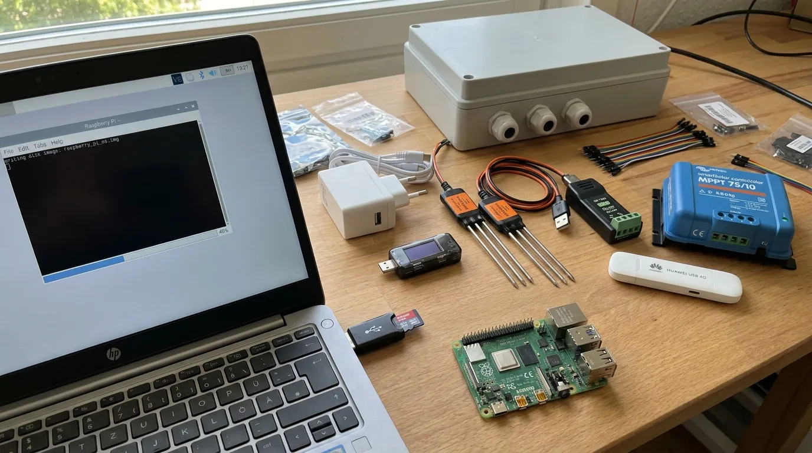

# Stage 0. Before you touch the parts

This stage needs a laptop and nothing else, so it is never a reason to wait.

## 0.1 Give the node a place to send to

**What it is.** The oracle at life.oncra.org keeps a *place* for every piece of land. Each device in the box (the microphone, the 10 cm probe, the 30 cm probe) gets its own token, a long password that tells the oracle who is posting. For the desk we use a throwaway place called `bench-tolhuisweg`, so real field data starts clean later.

**Done on 19 September.** The place exists and the three tokens are in the password manager. If you are building a second node, run the box below once.

```ai Register a bench place and mint three device tokens (only for a new node)
API=https://life.oncra.org/api/v1; H="authorization: Bearer $LIFE_ADMIN_KEY"
curl -s -XPOST $API/places -H "$H" -H 'content-type: application/json' -d '{"name":"Bench, <your town>","public":false,"country":"NL","landUse":"bench",
 "geometry":{"type":"Polygon","coordinates":[[[4.9012,52.3836],[4.9016,52.3836],[4.9016,52.3839],[4.9012,52.3839],[4.9012,52.3836]]]}}'
# note the slug in the answer, then one device each:
for d in '{"kind":"SOUND","model":"Life node v1, BirdNET-Go on Raspberry Pi 4, INMP441","heightM":0.5}' \
         '{"kind":"SOIL","model":"DFRobot SEN0600","depthCm":10,"notes":"Modbus address 1"}' \
         '{"kind":"SOIL","model":"DFRobot SEN0600","depthCm":30,"notes":"Modbus address 2"}'; do
  curl -s -XPOST $API/places/<slug>/devices -H "$H" -H 'content-type: application/json' -d "$d"; echo; done
# Each answer carries deviceToken (lo_dev_...) ONCE. Show the three tokens to the person and stop; they go in a password manager.
```

## 0.2 Prove the road is open before the node drives on it

**What it is.** Post one fake soil reading and one fake heartbeat by hand, then check that the oracle shows "last seen" on exactly the device you posted as. This separates "the server works" from "the node works", which otherwise get debugged as one problem at two in the morning.

**Done for two of three.** The 10 cm device was posted to on 19 September, the microphone device received a heartbeat on 25 September. The 30 cm device has never been posted to. That is the one open item.

```ai Post one synthetic row as the 30 cm probe and check only that device moved
TOK_SOIL_2=<token of the 30 cm device, from the person>
curl -s -XPOST https://life.oncra.org/api/v1/ingest/soil -H "authorization: Bearer $TOK_SOIL_2" -H 'content-type: application/json' \
  -d "{\"readings\":[{\"ts\":\"$(date -u +%FT%TZ)\",\"vwc\":24.1,\"tempC\":15.3}]}"
curl -s -H "authorization: Bearer $LIFE_ADMIN_KEY" https://life.oncra.org/api/v1/places/bench-tolhuisweg/devices \
 | python3 -c "import sys,json;[print(d['kind'],d.get('depthCm'),d['lastSeenAt']) for d in json.load(sys.stdin)['items']]"
# Pass = the 30 cm SOIL device now shows a time within the last minute and the other two did not change.
```

## 0.3 Order what is still missing

**What it is.** A short shopping list. None of it blocks the desk work in stage 1.

- **The solar panel.** Decide first where node 1 will stand. Under a crop that grows over the panel: 100 W ([Accuweb, Enjoy Solar 100 W](https://www.accuweb.nl/zonnepaneel-12-volt-100-watt.html)). On grass or a headland with open sky: 40 to 50 W is enough with the 10 Ah battery.
- **The bouwmarkt run.** Matt green outdoor spray paint for plastic and a plastic primer, 1 m of 2 x 2.5 mm² red/black wire, M5 ring terminals, an inline blade fuse holder with a 15 A fuse, a 3 mm plastic sheet cut to 300 x 200 mm, a piece of open-cell foam, a small rigid cap for the microphone hood, and a 2 m pressure-treated class 4 post with two M8 through-bolts.

```ai Print the shopping list from the order list, so nothing is forgotten
cd life && python3 - <<'PY'
import csv
for r in csv.DictReader(open('kit/order-list.csv')):
    if r['basket']!='alt' and 'bought' not in r['checked'] and 'paid' not in r['checked']:
        print(f"- {r['item']}: {r['product']} ({r['shop']}, about EUR {r['line_total_eur']}) {r['order_url']}")
PY
```

## 0.4 Put the software on the card and boot it once

**What it is.** The node runs one prepared disk image, the "golden image". Nothing personal is inside it. After writing it to the microSD card you copy one small text file with this node's three tokens onto the card, put the card in the Pi, and power it. The first boot sets itself up and reboots.

**Not done.** The image has been built and inspected on a workstation only. Its first boot on a real Pi is this stage's last gate. Three things must be right in the image or they are wrong in every node built from it: audio clip saving off, all node state on the `/data` partition, per-node settings arriving on the boot partition.



**With your hands:** put the card in a reader, run the box below, then move the card to the Pi, plug in the power supply through the meter, and wait about three minutes. Green light flickering is normal. The Pi reboots itself once.

```ai Write the golden image and this node's settings to the card (Linux or macOS laptop)
# 1. build or fetch the image (node/image/README.md has the exact command); it produces life-node-v1-<date>.img
# 2. find the card: run `lsblk` (Linux) or `diskutil list` (macOS) BEFORE and AFTER inserting it; the new device is the card.
#    Show the person the device name and wait for a yes. Writing to the wrong device destroys a disk.
sudo dd if=life-node-v1-<date>.img of=/dev/<card> bs=4M status=progress conv=fsync
# 3. mount the first (boot, FAT) partition and drop the settings beside life-node.env.example:
cp life-node.env.example /media/$USER/bootfs/life-node.env   # then edit it:
#    LIFE_DEVICE_TOKEN / _SOIL_1 / _SOIL_2 = the three tokens; HOSTNAME=life-node-1; SCHEDULE=bench; WIFI_SSID/WIFI_PSK = the desk WiFi
sync && umount /media/$USER/bootfs
# 4. after the person boots the Pi, wait ~3 min, then:
ssh $NODE 'systemctl list-timers --no-pager | grep -E "life-soil|life-sound"; touch /data/life-node/probe; ls /data/life-node; cat /proc/mounts | grep " / "'
ssh $NODE 'sudo reboot'; sleep 90; ssh $NODE 'ls /data/life-node/probe && echo SURVIVED'
# Pass = both timers listed, root mounted as overlay, and the probe file survived the reboot.
```

## Gate

The 30 cm device shows a "last seen" time, and a card boots on the Pi with both timers listed and a file that survives a reboot. Then go to [stage 1](1-bench.md).
