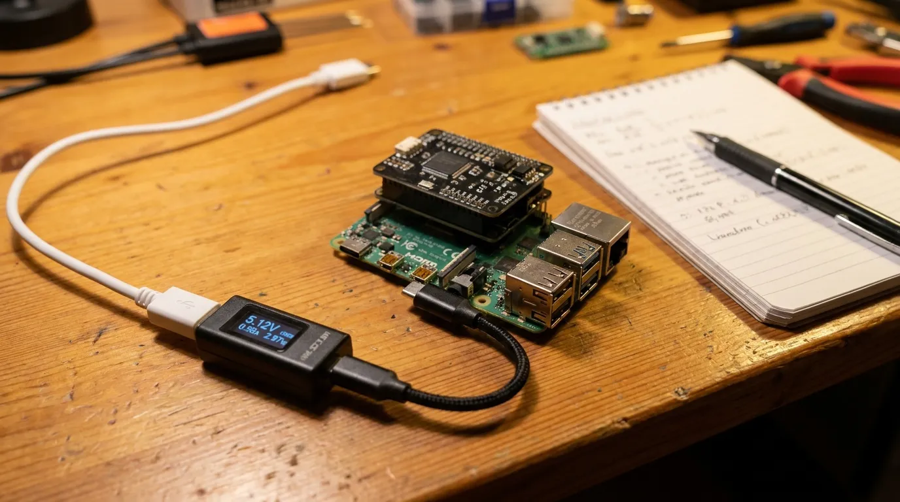
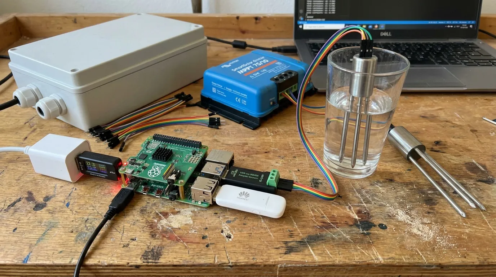
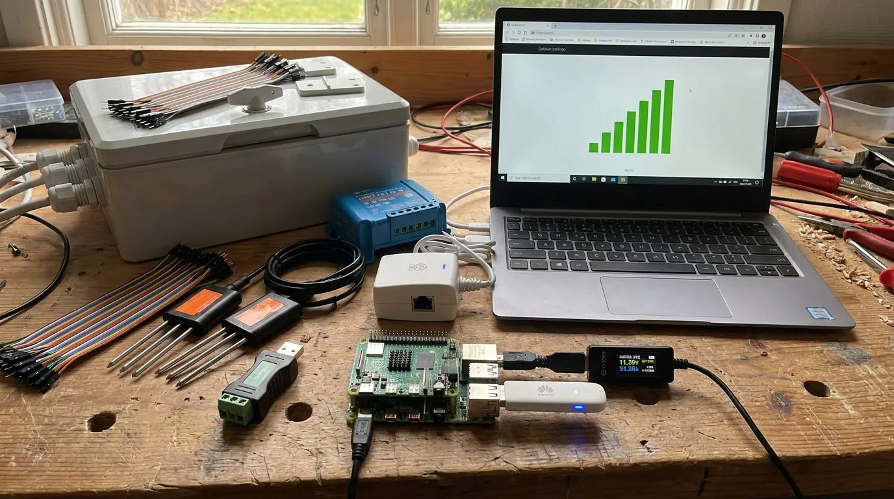

# Stage 1. Everything loose on the desk

Nothing goes in the box yet. The Pi runs from the white wall supply, through the small black meter, so that every step also tells you what it costs in power. Add one part, check it, write a line in the log, then the next part.

## 1.1 Check the parcels against the list

**What it is.** Lay everything out and tick it against the parts table at the bottom of this page. Check that each probe lead has four wires in brown, black, yellow and blue, the colours DFRobot publishes for the SEN0600 (see 1.3). A lead with other colours: stop and meter it before any power goes near it.

```ai Print a tick list of the parts this stage needs
# Life Box build plan, 1-bench (https://life.oncra.org/lifebox/1-bench): Print a tick list of the parts this stage needs. Cold start? Read the first box on https://life.oncra.org/lifebox.
[ -d life ] || git clone -q https://github.com/oncra/life; cd life && python3 - <<'PY'
import csv
want={'Computer','Storage','Bench supply','Instrument','I2S header','Microphone','Mic wiring','RS485 adapter','Soil probe','probe power','Modem','SIM','terminations'}
for r in csv.DictReader(open('kit/order-list.csv')):
    if r['basket']!='alt' and r['item'] in want: print(f"[ ] {r['qty']} x {r['product']}  ({r['shop']})")
PY
# Then ask the person whether both probe leads are brown, black, yellow and blue (DFRobot's code: VCC, GND, 485-A, 485-B); note any difference in kit/bench-log.csv row 1.3 "probe lead colours", by pull request.
```

## 1.2 Measure how much the Pi drinks

**What it is.** The most important half hour of the whole build. Every energy figure in the design rests on the sentence "about 5 W while awake", and nobody has measured it. The meter sits **between the wall supply and the Pi**, because the Pi takes its power over USB-C. Read it three times: at the login prompt, during the first twenty seconds of boot (the peak), and after BirdNET-Go has been listening for ten minutes. Also note the voltage under load; below 4.9 V the supply is sagging.



**If the awake figure is above about 6.5 W,** stop and say so: the summer margin is gone and either the schedule or the panel changes before anything else is bought.

```ai Record the three power readings the person read off the meter
# Life Box build plan, 1-bench (https://life.oncra.org/lifebox/1-bench): Record the three power readings the person read off the meter. Cold start? Read the first box on https://life.oncra.org/lifebox.
# Ask for: idle W, boot peak W, BirdNET-Go running W, volts under load. Then, in a fresh branch of the life repo:
python3 - <<'PY'
import csv,datetime
vals={'Pi 4 idle at the prompt':'<idle>','Pi 4 boot peak':'<peak>','Pi 4 with BirdNET-Go running':'<running>','supply voltage under load':'<volts>'}
rows=list(csv.reader(open('kit/bench-log.csv'))); h=rows[0]
for r in rows[1:]:
    if r[1] in vals: r[5]=vals[r[1]]; r[6]=datetime.date.today().isoformat()
csv.writer(open('kit/bench-log.csv','w',newline=''),lineterminator='\n').writerows(rows)
PY
git checkout -b bench/power && git commit -am "Bench log: Pi 4 power measured" && git push -u origin bench/power && gh pr create --fill
# If the running figure is above 6.5 W, say so in the PR body and tell the person the panel or schedule must change.
```

## 1.3 Give the two probes different names

**What it is.** Both probes leave the factory answering to address 1. They share one cable to the Pi (RS485 is a bus: the Pi asks each device in turn by its address), so two probes on the same address talk over each other and neither is heard. One of them has to become address 2 first, and that only works with that probe **alone** on the cable. So: first one probe, give it address 2, then the second one joins it on the same terminals. One USB-to-RS485 adapter serves both.

**The wires.** DFRobot's colour code for the SEN0600 lead ([wiki](https://wiki.dfrobot.com/sen0600/)):

| Probe wire | Is | Goes to |
| --- | --- | --- |
| brown | power, 5 to 30 V | USB screw terminal **VCC** (5 V) |
| black | ground | USB screw terminal **GND** |
| yellow | RS485 A | adapter **A+** |
| blue | RS485 B | adapter **B−** |

The adapter's own **GND** terminal and the screw terminal's **D−**, **D+** and **ID** stay empty. Ground is already shared through the Pi, because both USB devices plug into it.


**Step 1, one probe (the 30 cm one).**

1. Pi off: pull the supply.
2. Plug the RS485 adapter into one USB port of the Pi and the USB screw terminal into another.
3. Take one probe; the other stays in its bag. Strip and ferrule its four wires, one ferrule per wire.
4. Brown into **VCC** and black into **GND** of the USB screw terminal; yellow into **A+** and blue into **B−** of the adapter. One wire per terminal, screws tight, tug each wire.
5. Pi on. Run the scan and the address write from the box below. The probe answers on 1, then on 2.
6. If the scan still shows 1: pull the USB screw terminal out for a second and plug it back (some probes only take a new address after a power cycle), then scan again.
7. Wrap tape round this probe's lead: **"30 cm, address 2"**. The two probes look identical, and from here on the tape is the only way to tell them apart.

**Step 2, both probes.**

1. Pi off again.
2. Take the four wires of the taped probe out of their terminals and cut off their single ferrules.
3. Lay the second probe's wires next to them, **same colour with same colour**: the two browns together, the two blacks, the two yellows, the two blues. Never two different colours in one ferrule.
4. Each pair goes into **one ferrule together**, crimped: take the next size up from the single ferrules in the assortment, the smallest one both wires just slide into. Tug each wire after crimping; neither may pull out.
5. The four doubled ferrules go back into exactly the same terminals as in step 1: browns to VCC, blacks to GND, yellows to A+, blues to B−.
6. Pi on, scan: two answers, on 1 and 2. The untaped probe on address 1 goes in at 10 cm, the taped one on address 2 at 30 cm; that matches `SOIL_1` and `SOIL_2` in `life-node.env`.

For the bench only, two wires twisted together under one screw also hold. In the box they get a shared ferrule, because a twisted pair works loose with temperature swings over a season.

**When nothing answers.** Yellow and blue swapped: nothing breaks, but nobody answers. Swap them before suspecting anything else. One answer instead of two in step 2: the taped probe lost its address (power cycle and scan) or one wire of a pair is loose in its ferrule (tug it). No termination resistor is needed on 2 m leads at 9600 baud.



**Sanity checks with your hands:** prongs in air should read near zero moisture, prongs in a glass of water near saturation, and a hand around the prongs should move the temperature within a minute.

```ai Scan the bus, move one probe to address 2, confirm both answer
# Life Box build plan, 1-bench (https://life.oncra.org/lifebox/1-bench): Scan the bus, move one probe to address 2, confirm both answer. Cold start? Read the first box on https://life.oncra.org/lifebox.
NODE=${NODE:-life@life-node-1.local}     # the Pi: user life, password "lifebox" unless NODE_PASSWORD was set in life-node.env
# step 1: ONE probe wired (brown VCC, black GND, yellow A+, blue B-)
ssh $NODE 'life-soil-agent --scan'                       # with ONE probe connected: expect one answer at address 1, raw words and decoded values
ssh $NODE 'life-soil-agent --set-address 2 --addr 1'     # writes register 0x07D0
# if the next scan still shows address 1: some probes take a new address only after a power cycle; unplug the USB screw terminal for a second
ssh $NODE 'life-soil-agent --scan'                       # expect the same probe at address 2
# now step 2: Pi off, the person joins the second probe's wires to the first, same colour in one ferrule, Pi on:
ssh $NODE 'life-soil-agent --scan'                       # expect addresses 1 and 2
# Judge the decoded values: in air moisture near 0 %, in water near 100 %, temperature near room temperature.
# Stable raw words with nonsense values mean the sen0600 profile (node/life-soil-agent.py) is wrong, not the probe: fix the register map from the words, by PR.
# Record raw words in air and in water in bench-log rows 1.3.
```

## 1.4 The first real soil reading

**What it is.** With both probes on the cable and the tokens in place, run the soil agent once by hand, then let its timer run it. On the bench place both soil devices should show a fresh "last seen".

```ai Run the soil agent once and watch both soil devices move on the oracle
# Life Box build plan, 1-bench (https://life.oncra.org/lifebox/1-bench): Run the soil agent once and watch both soil devices move on the oracle. Cold start? Read the first box on https://life.oncra.org/lifebox.
NODE=${NODE:-life@life-node-1.local}     # the Pi: user life, password "lifebox" unless NODE_PASSWORD was set in life-node.env
: "${LIFE_ADMIN_KEY:?export LIFE_ADMIN_KEY first: the oracle steward key from the plan maintainer, or your own oracle ADMIN_API_KEY}"
ssh $NODE 'sudo systemctl start life-soil.service; sleep 5; journalctl -u life-soil --no-pager -n 20'
curl -s -H "authorization: Bearer $LIFE_ADMIN_KEY" https://life.oncra.org/api/v1/places/bench-tolhuisweg/devices \
 | python3 -c "import sys,json;[print(d['kind'],d.get('depthCm'),d['lastSeenAt']) for d in json.load(sys.stdin)['items']]"
# Pass = both SOIL devices show a time within the last few minutes. Then confirm the timer: ssh $NODE 'systemctl list-timers life-soil.timer'
```

## 1.5 The microphone hears a bird

**What it is.** The microphone is a fingernail-sized board. It connects with four short jumper wires to the tall stacking header (put the header on first, so the pins stay reachable once the Witty Pi sits on top). Then play a known bird call from your phone next to it. A confident detection of the right species is the gate. Hiss in a quiet room means a wiring or gain fault, not a quiet room.

, 3.3 V and ground; ten centimetres of wire.")

```ai Check the microphone level, then watch BirdNET-Go for the detection
# Life Box build plan, 1-bench (https://life.oncra.org/lifebox/1-bench): Check the microphone level, then watch BirdNET-Go for the detection. Cold start? Read the first box on https://life.oncra.org/lifebox.
NODE=${NODE:-life@life-node-1.local}     # the Pi: user life, password "lifebox" unless NODE_PASSWORD was set in life-node.env
ssh $NODE 'arecord -l; arecord -D default -f S32_LE -r 48000 -c 2 -d 5 /tmp/t.wav && sox /tmp/t.wav -n stat 2>&1 | grep -i "rms\|maximum"'
# Silence plus a flat hiss = wiring or gain. A level that moves when the person claps = good.
ssh $NODE 'journalctl -u birdnet-go -f'   # keep this open while the person plays a blackbird (Turdus merula) call from a phone
# Pass = a detection line with the right species and confidence >= 0.7. Record the confidence in bench-log row 1.5.
# The node's BirdNET-Go web page is on port 8080 on the bench (ssh -L 8080:localhost:8080 $NODE) if you want to look.
```

## 1.6 The modem sends it all over 4G

**What it is.** The white USB stick is the node's own phone line. Put the SIM in, plug it in, set the network name (APN) once in its own small web page, then switch the desk WiFi off so you are sure you are testing the real road. One full hour of posting over 4G should cost about 12 kB; the ten-year SIM budget depends on that. The heartbeat also reports which mobile cell the node is in. That first cell becomes the node's home: carry the node to another cell later and the oracle must raise a *moved* alarm.



```ai Take the node onto 4G only, post once, and check the heartbeat and the byte count
# Life Box build plan, 1-bench (https://life.oncra.org/lifebox/1-bench): Take the node onto 4G only, post once, and check the heartbeat and the byte count. Cold start? Read the first box on https://life.oncra.org/lifebox.
NODE=${NODE:-life@life-node-1.local}     # the Pi: user life, password "lifebox" unless NODE_PASSWORD was set in life-node.env
: "${LIFE_ADMIN_KEY:?export LIFE_ADMIN_KEY first: the oracle steward key from the plan maintainer, or your own oracle ADMIN_API_KEY}"
ssh $NODE 'nmcli radio wifi off; ip -br link; ip route'                 # the stick must be the only route (enx… or usb0)
ssh $NODE 'curl -s http://192.168.8.1/api/monitoring/traffic-statistics | grep -o "<TotalDownload>[0-9]*\|<TotalUpload>[0-9]*"'   # bytes before
ssh $NODE 'life-heartbeat --json'                                       # must print plmn and cellId
ssh $NODE 'sudo systemctl start life-sound.service; sleep 20; journalctl -u life-sound --no-pager -n 10'
ssh $NODE 'curl -s http://192.168.8.1/api/monitoring/traffic-statistics | grep -o "<TotalDownload>[0-9]*\|<TotalUpload>[0-9]*"'   # bytes after
curl -s -H "authorization: Bearer $LIFE_ADMIN_KEY" https://life.oncra.org/api/v1/places/bench-tolhuisweg/devices | python3 -c "import sys,json;[print(d['kind'],d['lastHeartbeatAt']) for d in json.load(sys.stdin)['items']]"
# Record the byte difference in bench-log row 1.6 and the signal (dBm from the stick's page) in the next row. Then: nmcli radio wifi on.
```

## Gate

Both probes answer on their own addresses, one detection and two soil rows arrived at the bench place over 4G, and the awake draw is a number in the log. Then go to [stage 2](2-power.md).
