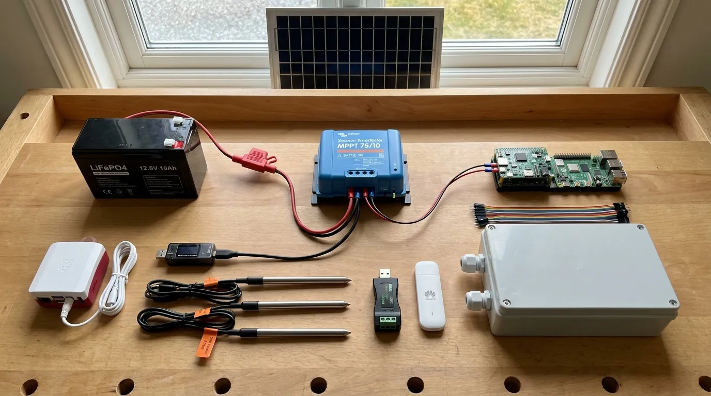

# Stage 2. Running on its own power

In the field there is no wall socket. The panel charges a battery, the blue Victron controller manages that, and the Witty Pi (the small board on top of the Pi) is an alarm clock that switches the Pi on for the hours it should listen and off for the rest. This stage puts that chain together on the desk and lets it run a day without you.



## 2.1 Connect in this order, battery last

**What it is.** Wires from the controller's LOAD output to the Witty Pi's power input (it takes 6 to 30 V and makes the 5 V the Pi needs). Witty Pi on the Pi's header, above the stacking header. Probes on 5 V from the USB screw terminal, so they switch off with the Pi. **Then** the battery, through the 15 A fuse, which sits close to the battery post and is not optional. Set the controller to its LiFePO4 preset in the Victron app. The panel can lean against a window: indoors it behaves like a tenth of itself, which is enough to see the controller charge.

```ai Confirm the Pi is fed by the Witty Pi and read what the controller and node report
# Life Box build plan, 2-power (https://life.oncra.org/lifebox/2-power): Confirm the Pi is fed by the Witty Pi and read what the controller and node report. Cold start? Read the first box on https://life.oncra.org/lifebox.
NODE=${NODE:-life@life-node-1.local}     # the Pi: user life, password "lifebox" unless NODE_PASSWORD was set in life-node.env
ssh $NODE 'cat /sys/firmware/devicetree/base/model; vcgencmd get_throttled; vcgencmd measure_volts'   # 0x0 = no under-voltage
ssh $NODE 'ls /data/wittypi; cat /data/wittypi/schedule.wpi 2>/dev/null | head; systemctl status wittypi --no-pager | head -5'
# The battery voltage is read by the person in the Victron app (Bluetooth) until the VE.Direct cable of v1.1; ask for it and record bench-log row 2.4 "battery voltage floor" each morning.
```

## 2.2 Set the alarm clock

**What it is.** Start with the `bench` schedule: awake fifteen minutes in every hour, so one day gives a dozen cycles instead of one. Check that the node empties its queue before it switches itself off (the *flush* service) and that the oracle sees a `shutdown` heartbeat, so a planned sleep and a crash look different. Only then set the real schedule: about ten hours a day March to October, one hour a day November to February, at a fixed clock time.

```ai Put the node on the bench schedule and verify the flush before sleep
# Life Box build plan, 2-power (https://life.oncra.org/lifebox/2-power): Put the node on the bench schedule and verify the flush before sleep. Cold start? Read the first box on https://life.oncra.org/lifebox.
NODE=${NODE:-life@life-node-1.local}     # the Pi: user life, password "lifebox" unless NODE_PASSWORD was set in life-node.env
: "${LIFE_ADMIN_KEY:?export LIFE_ADMIN_KEY first: the oracle steward key from the plan maintainer, or your own oracle ADMIN_API_KEY}"
ssh $NODE 'grep ^SCHEDULE /data/life-node/life-node.env'          # should read SCHEDULE=bench for this stage
ssh $NODE 'sudo systemctl restart life-schedule.service; cat /data/wittypi/schedule.wpi'
# After the first sleep-wake cycle:
ssh $NODE 'journalctl -u life-flush -b -1 --no-pager | tail -20; ls -la /data/life-node/'   # flush ran in the previous boot, queue file empty
curl -s -H "authorization: Bearer $LIFE_ADMIN_KEY" https://life.oncra.org/api/v1/places/bench-tolhuisweg/devices | python3 -c "import sys,json;[print(d['kind'],d['lastHeartbeatAt']) for d in json.load(sys.stdin)['items']]"
# Pass = heartbeat times advance once per hour on their own. Record "shutdown flush: 0 rows left" in bench-log row 2.2.
```

## 2.3 Pull the plug, three times

**What it is.** The most likely failure in a field is power that goes away mid-sentence. Pull the battery lead while the node is awake and working, three times. Each time it must come back on its own, with nothing lost from the card and nothing lost from the queue. Ten minutes on a desk; this is the test that decides whether the read-only root design earns its keep.

```ai After each of the three brown-outs, check the node came back clean
# Life Box build plan, 2-power (https://life.oncra.org/lifebox/2-power): After each of the three brown-outs, check the node came back clean. Cold start? Read the first box on https://life.oncra.org/lifebox.
NODE=${NODE:-life@life-node-1.local}     # the Pi: user life, password "lifebox" unless NODE_PASSWORD was set in life-node.env
ssh $NODE 'uptime; sudo dmesg | grep -i -E "ext4-fs error|corrupt" | head; journalctl -b --no-pager -p err | head; ls -la /data/life-node/'
ssh $NODE 'life-soil-agent --scan | head -3'   # probes still answer
# Pass = three clean returns. Record 3 of 3 in bench-log row 2.3, with any error lines in the notes.
```

## 2.4 A day and a night unattended

**What it is.** Leave it for 24 hours with the meter logging, and compare with the model: 54.6 Wh per day in summer, 9.6 in winter, and a 4.6 Wh per day floor that the controller eats even with the node asleep. More than about 20 percent above the model means the energy section of the design is wrong and gets corrected, not explained.

```ai Turn the person's meter readings into Wh/day and compare with the model
# Life Box build plan, 2-power (https://life.oncra.org/lifebox/2-power): Turn the person's meter readings into Wh/day and compare with the model. Cold start? Read the first box on https://life.oncra.org/lifebox.
# Ask for: meter Wh at start, Wh at end, hours between; and for the floor test the same with the node kept off.
python3 -c "s,e,h=<start>,<end>,<hours>; d=(e-s)/h*24; print(f'{d:.1f} Wh/day, model 54.6 summer (bench schedule scales: 15 min/h = 6 h/day awake), {d/54.6*100:.0f}% of model')"
# Write the result into bench-log rows 2.4 (energy, parasitic floor, voltage floor) by PR. If more than 20% above the model, say so plainly: the kit page's energy section must change.
```

## Gate

Three unattended cycles completed, and a measured Wh per day in the log. Then go to [stage 3](3-box.md).
