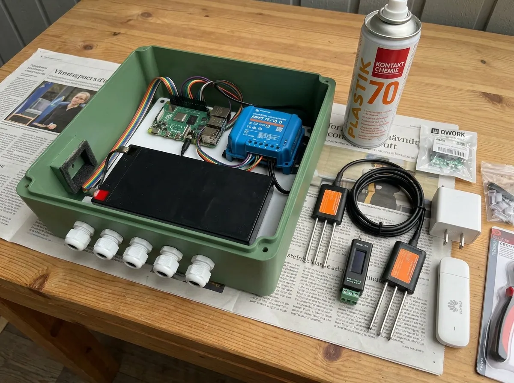
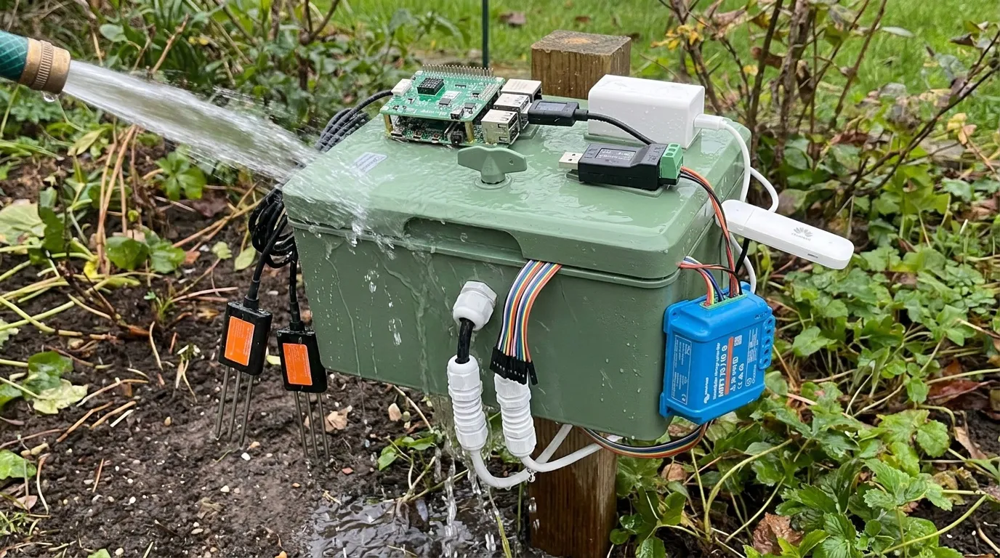

# Stage 3. Into the box

Only now does anything go into the enclosure, because everything in it has already been proven working in the open.



## 3.0 Update the drawings first

**What it is.** The three drawings of the mount, the wiring and the energy balance still assume a panel of 1010 by 540 mm. Whatever panel was bought, the drawings are regenerated from their scripts with the real size before anyone drills. Never hand-edit a drawing.

```ai Regenerate the three drawings with the real panel size
# Life Box build plan, 3-box (https://life.oncra.org/lifebox/3-box): Regenerate the three drawings with the real panel size. Cold start? Read the first box on https://life.oncra.org/lifebox.
[ -d life ] || git clone -q https://github.com/oncra/life; cd life && grep -n "1010\|540" kit/draw-low-mount.py kit/draw-wiring.py kit/draw-energy.py
# Change the panel width/height constants to the bought panel (ask the person; the 100 W Enjoy Solar is 1190 x 540 mm, 8.8 kg), then:
python3 kit/draw-low-mount.py && python3 kit/draw-wiring.py && python3 kit/draw-energy.py
git checkout -b box/drawings && git commit -am "Drawings: real panel size" && git push -u origin box/drawings && gh pr create --fill
```

## 3.1 Paint the box

**What it is.** The box is ABS plastic, which sunlight makes chalky and brittle in a few years. Matt green outdoor paint for plastic is its sun cream first and its camouflage second. Primer unless the can says it sticks to ABS. Paint it empty, outside, before anything goes in.

## 3.2 Lay everything out on plastic, not steel

**What it is.** The box ships with a steel mounting plate. Leave it out: steel next to the 4G stick weakens its signal. Use the 3 mm plastic sheet and the nylon standoffs. The battery lies flat and takes half the floor, so it decides where everything else goes.

## 3.3 The hole the microphone listens through

**What it is.** A 5 mm hole in the wall, the thin waterproof membrane stuck over it on the inside, and the microphone board pressed flat against the wall over that, with a small gasket. The microphone hears through a port on its underside; an air gap there becomes a whistle. Outside, a small rigid cap with foam inside it, opening downward, keeps wind and rain off. Until the membrane arrives (12 to 24 October) test with a bare hole and note the difference later.

## 3.4 Five glands, all pointing down

**What it is.** Panel lead, two probe leads, one vented gland at the lowest point so the box can breathe, one spare left blanked. Cut the panel's plug connectors off, put ferrules on the wire ends, straight into the controller.

## 3.5 Spray the boards

**What it is.** The Plastik 70 lacquer is a thin clear coat that keeps damp air off the Pi, the RS485 adapter and the microphone board. Mask the microphone port and every connector with tape first. This replaces the silica gel bags that nobody ever dries out.

## 3.6 Dry test, then wet test

**What it is.** Close the lid and let the node run a full cycle. Write down the 4G signal strength from inside the closed box: that number decides whether the stick can stay inside or whether an outside antenna gets bought after all. Then five minutes with a garden hose from every side. Open it. Look for water. Then measure the power draw again with the lid on in the sun, because a warm Pi is a thirstier Pi.



```ai Read the signal from inside the closed box and compare with the desk baseline
# Life Box build plan, 3-box (https://life.oncra.org/lifebox/3-box): Read the signal from inside the closed box and compare with the desk baseline. Cold start? Read the first box on https://life.oncra.org/lifebox.
NODE=${NODE:-life@life-node-1.local}     # the Pi: user life, password "lifebox" unless NODE_PASSWORD was set in life-node.env
ssh $NODE 'curl -s http://192.168.8.1/api/device/signal | grep -o "<rsrp>[^<]*\|<rsrq>[^<]*\|<sinr>[^<]*"'
# Do this once with the lid off (desk baseline, bench-log row 1.6) and once with the lid closed and painted (row 3.6).
# More than about 10 dB worse inside = tell the person: the CRC9 pigtail, SMA extension and whip from the order list's alt rows get bought.
```

## 3.7 The alarm

**What it is.** A small board with a tiny chip watches three switches: one in the lid, one on the panel bracket, one that feels tilt. If the lid opens without permission it chirps for a minute while the Pi wakes up and asks the oracle whether a maintenance window is open; if not, the siren goes off and the oracle raises a *tamper* alarm. A green light through the wall tells the landowner it is safe to open. Build the board, flash the chip from the Pi, fit the switches, and run the four tests in the box below, siren wired last.

```ai Flash the guard from the Pi and run the four tests in order
# Life Box build plan, 3-box (https://life.oncra.org/lifebox/3-box): Flash the guard from the Pi and run the four tests in order. Cold start? Read the first box on https://life.oncra.org/lifebox.
NODE=${NODE:-life@life-node-1.local}     # the Pi: user life, password "lifebox" unless NODE_PASSWORD was set in life-node.env
: "${LIFE_ADMIN_KEY:?export LIFE_ADMIN_KEY first: the oracle steward key from the plan maintainer, or your own oracle ADMIN_API_KEY}"
ssh $NODE 'cd /usr/local/lib/life-guard 2>/dev/null || cd ~/life/node/firmware/life-guard; sudo ./flash.sh'    # writes the hex over GPIO
ssh $NODE 'sudo sed -i "s/^GUARD=.*/GUARD=1/" /data/life-node/life-node.env; life-guard status --json'          # test 1: armed, and each loop named as the person opens it
# test 2: person opens the lid with no window: expect chirps, Pi boots, then within a minute:
curl -s -H "authorization: Bearer $LIFE_ADMIN_KEY" https://life.oncra.org/api/v1/places/bench-tolhuisweg/alerts | python3 -c "import sys,json;[print(a['kind'],a.get('detail')) for a in json.load(sys.stdin)['items']]"   # TAMPER, loop lid; siren at 60 s
# test 3: open a window, then the person opens the lid: chirps, LED green, silence
curl -s -XPUT -H "authorization: Bearer $LIFE_ADMIN_KEY" -H 'content-type: application/json' -d '{"hours":1}' https://life.oncra.org/api/v1/places/bench-tolhuisweg/devices/<SOUND device id>/maintenance
# test 4: window set, lid closed, wait for the hourly heartbeat (it carries the window to the node), then open: no chirp at all.
# Record seconds from lid-open to green LED in bench-log (add a row 3.7). Then delete the window: same URL with -XDELETE.
```

## Gate

A closed box completes a cycle, the signal strength is written down, the inside is dry after the hose, and the guard passes its four tests. Then go to [stage 4](4-post.md).
