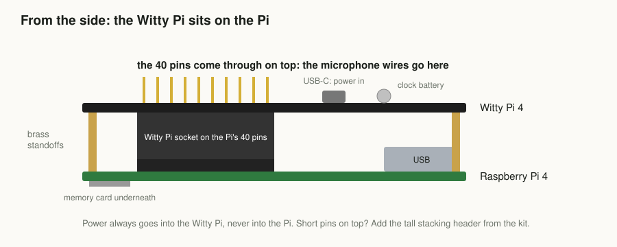
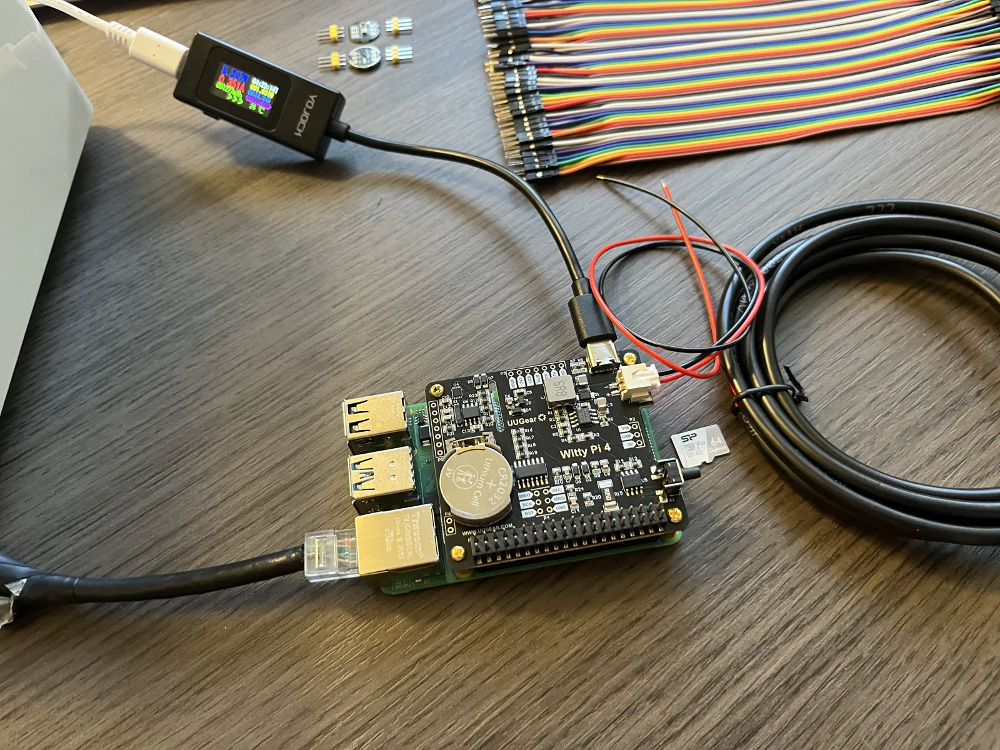
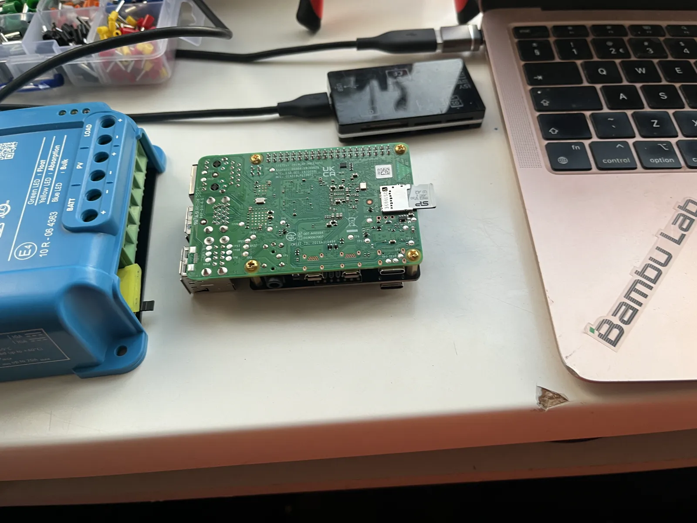
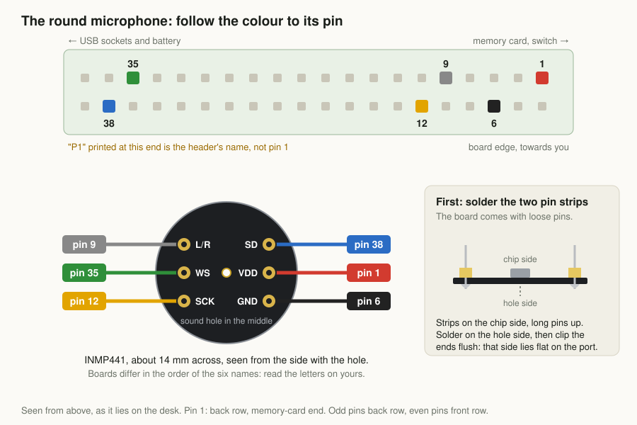
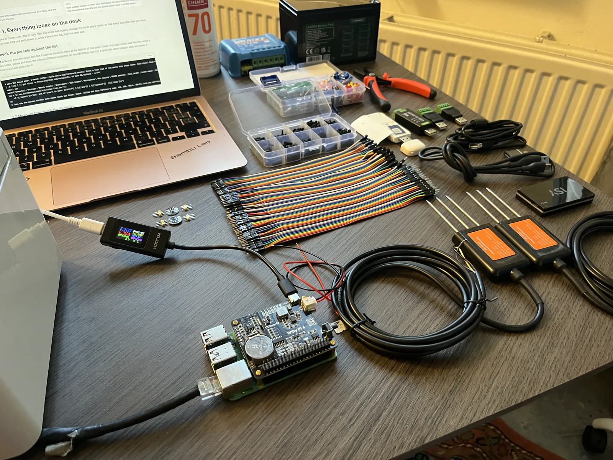
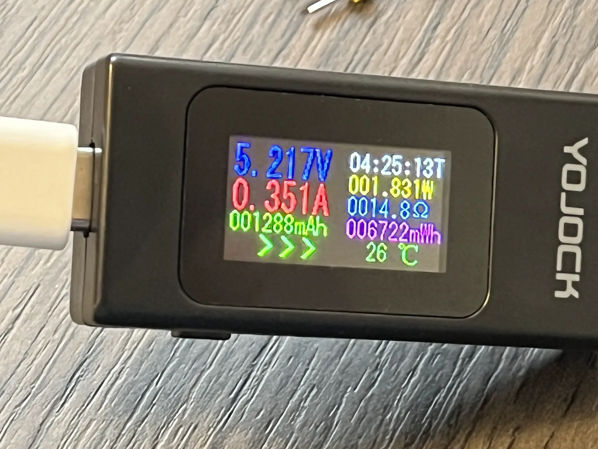
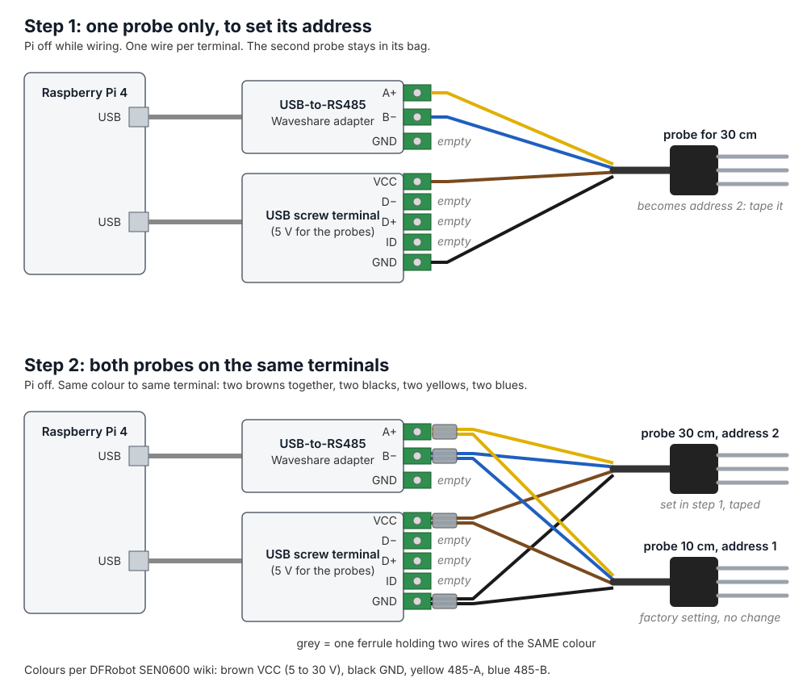
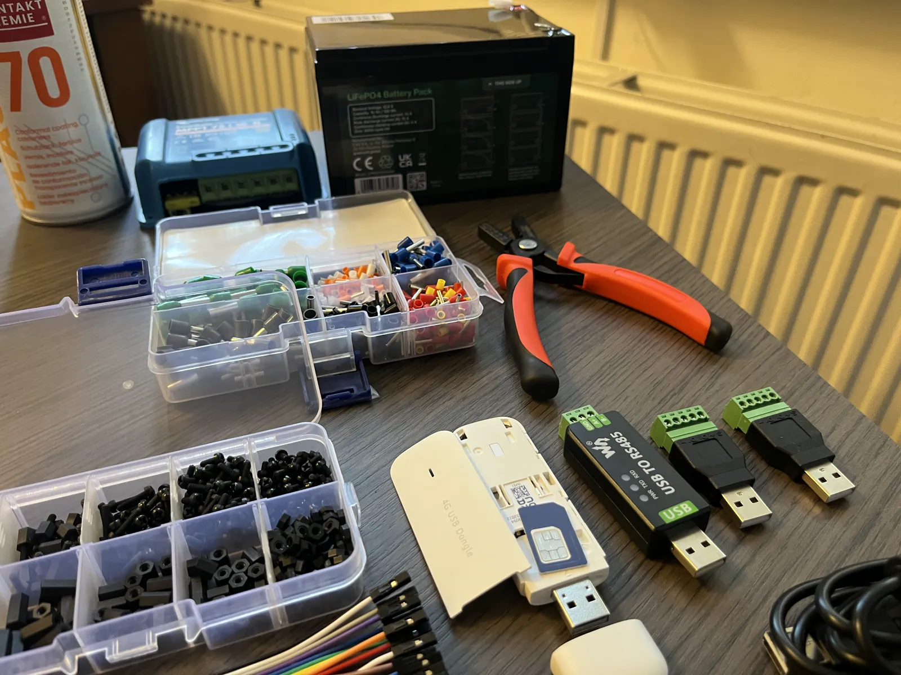

## Lay out the parts

Put everything for this part on the table and tick it off against the list at the end of this part. Look at each soil probe's cable: it should have four wires, **brown, black, yellow and blue**. A cable with other colours: stop here and ask before you connect it, because a wrong wire on the power can break the probe.

Nothing goes into the enclosure yet. On the desk you can see every light and reach every wire.

> **Check.** Every line in the list has its part on the table.

## Put the Witty Pi on the Pi

The Witty Pi is the box's alarm clock: it switches the Pi on for the hours it should listen, and off for the rest. It sits on top of the Pi.

1. Screw the four brass standoffs from the Witty Pi's bag into the corner holes of the Pi.
2. Press the Witty Pi onto the Pi's 40 pins, straight down, all the way, and screw it to the standoffs.
3. Put the small round battery (CR2032) in its holder on the Witty Pi, if one came with it. It keeps the clock running when the power is off.
4. Put the memory card into the slot on the underside of the Pi.

The Pi's 40 pins come through on top of the Witty Pi, along its edge. The microphone connects to them in the next step.

From now on the power always goes into the **Witty Pi**, never into the Pi itself: the Witty Pi feeds the Pi, and that is how it can switch it on and off.

Do not switch anything on yet.

## Wire the microphone

The microphone is the small square board, about the size of a fingernail. It connects with five short jumper wires to the pins on top of the Witty Pi. The pins are numbered: pin 1 is the corner pin at the end away from the USB sockets, odd numbers on the row towards the middle of the board, even numbers on the row along the edge.

| Microphone pin | Header pin | What it is |
| :-- | :-- | :-- |
| VDD | 1 | 3.3 V power |
| GND | 6 | ground |
| L/R | 9 | ground (left channel) |
| SCK | 12 | clock |
| WS | 35 | word select |
| SD | 38 | sound data |

Check each wire twice against the table. Power on the wrong pin can break the microphone, nothing else.

## Switch on for the first time

1. Plug the small black meter into the power supply, and the supply's cable from the meter into the **USB-C socket of the Witty Pi** (not the one on the Pi).
2. Plug the supply into the wall. If the Pi does not start by itself, press the button on the Witty Pi once.
3. Wait. The first start takes a few minutes and the box restarts itself once. A flickering green light is normal.

Write down the watts the meter shows after ten minutes. About 5 W is expected; that number decides how big the battery and panel need to be. Above 6.5 W, tell us via the feedback box at the bottom of this page.

On the desk the box wakes up once an hour and listens for 15 minutes, then switches itself off. That is the Witty Pi doing its job. When the box seems dead, look at the clock: it is waiting for the next hour.

> **Check.** On your box page, **The box is on** turns green. That can take up to 15 minutes after switching on.

## Let it hear a bird

Play a blackbird or a robin from your phone, close to the microphone, for a minute or two. Any recording of a garden bird will do; search for *blackbird song* on YouTube.

> **Check.** On your box page, **Microphone** turns green with the name of the bird. The box sends what it heard once an hour, so this light can take up to an hour. Only hiss and no bird after two tries: check the five wires against the table.

## Connect the 30 cm soil probe, alone

Both probes leave the factory with the same address, so the box cannot tell them apart. You fix that by connecting **one probe first**: the box sees a single probe and gives it its own address by itself. Then the second one joins.

1. Switch off: pull the power supply out of the wall.
2. Plug the **RS485 adapter** into a USB port of the Pi, and the **USB screw terminal** into another.
3. Take one probe; leave the other in its bag. No ferrules needed yet: the bare wires go straight into the terminals.
4. **Brown** into **VCC** and **black** into **GND** of the USB screw terminal. **Yellow** into **A+** and **blue** into **B−** of the RS485 adapter. Tighten the screws and tug each wire.
5. Wrap a piece of tape around this probe's cable and write **30 cm** on it. The two probes look the same; from now on the tape is the only way to tell them apart.
6. Put the prongs in a glass of water and switch on.

> **Check.** On your box page, **Soil probe 30 cm** turns green, with a moisture close to 100% (the prongs are in water). Then switch off. Nothing on the light after an hour: yellow and blue are probably swapped. Swapping them back breaks nothing.

## Add the 10 cm soil probe

1. Switch off.
2. Take the four wires of the taped probe out of their terminals.
3. Lay the second probe's wires next to them, **same colour with same colour**: brown with brown, black with black, yellow with yellow, blue with blue.
4. Put each pair into **one ferrule together** (one that holds two wires) with the crimping pliers and crimp it. Tug both wires; neither may come out.
5. Put the four double ferrules back into the same terminals as before.
6. Prongs of both probes in the air this time, and switch on.

> **Check.** Both **Soil probe 10 cm** and **Soil probe 30 cm** are green with a fresh time, and the moisture now reads close to 0% (the prongs are in air). Hold the prongs of one probe in your hand for a minute: its temperature goes up on the next reading.

## Connect the 4G stick

The white stick is the box's own phone line, for the field where there is no WiFi.

1. Slide the SIM into the stick.
2. Plug the stick into **your laptop** first. After half a minute, open [192.168.8.1](http://192.168.8.1) in your browser: that is the stick's own page.
3. Under the mobile network settings (often *Settings*, then *Profile management*), add a profile with the network name (APN) **iot.1nce.net**, save it, and make it the default.
4. When the stick's light shows it is connected, take it out of the laptop and plug it into the Pi.

> **Check.** On your box page, **4G** turns green after the next hourly wake-up. All lights green: the electronics work. Well done.
