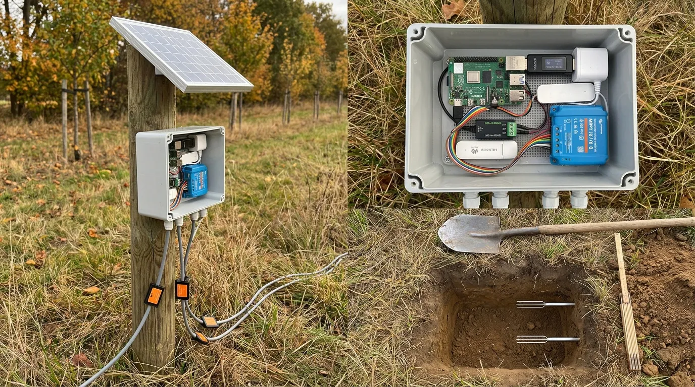

# Stage 4. Into the ground



## 4.1 The post

**What it is.** A two metre pressure-treated post, driven 800 mm into the ground, box at 500 mm. The panel is a half square metre sail: in a storm it pulls with the weight of a large dog, which is why the post is not shorter and why the panel brackets are bolted right through the wood rather than strapped, because straps loosen as wood shrinks.

## 4.2 The probes, a step and a half to the south

**What it is.** Dig a small pit wider than a spade, 1.5 m south of the post, so the panel's shadow (which always falls north) never lands on the probes. Push the prongs **sideways into the untouched wall of the pit**, one at 10 cm deep and one at 30 cm. Never hammer them. Fill the pit back in the same order the soil came out, and press it firm. Air pockets read dry for months. Then wait a day or two before believing a number.

## 4.3 Tell the oracle where the node really is

**What it is.** The bench place was a throwaway. Now the real place gets registered with its true outline, three new tokens are written into the node, and you watch the first upload arrive. Note the probes' position to the metre and mark it, so that machinery misses them and a person can find them in five years. Arm the guard and hand the landowner the one rule: green light means safe to open.

```ai Register the real place, swap the tokens, and watch the first upload
API=https://life.oncra.org/api/v1; H="authorization: Bearer $LIFE_ADMIN_KEY"
# 1. the outline as GeoJSON from the person (or draw it at https://life.oncra.org/places/new and read the slug back)
curl -s -XPOST $API/places -H "$H" -H 'content-type: application/json' -d @place.json
# 2. three devices as in stage 0.1, with lat/lon of the post and depthCm of each probe; keep the three tokens
# 3. on the node, replace the tokens in the env and restart the timers:
ssh $NODE 'sudo sed -i -e "s/^LIFE_DEVICE_TOKEN=.*/LIFE_DEVICE_TOKEN=<sound>/" -e "s/^LIFE_DEVICE_TOKEN_SOIL_1=.*/LIFE_DEVICE_TOKEN_SOIL_1=<soil1>/" -e "s/^LIFE_DEVICE_TOKEN_SOIL_2=.*/LIFE_DEVICE_TOKEN_SOIL_2=<soil2>/" -e "s/^SCHEDULE=.*/SCHEDULE=season/" /data/life-node/life-node.env; sudo systemctl restart life-soil.timer life-sound.timer life-schedule.service'
# 4. watch:
curl -s -H "$H" $API/places/<slug>/devices | python3 -c "import sys,json;[print(d['kind'],d.get('depthCm'),d['lastSeenAt'],d['lastHeartbeatAt']) for d in json.load(sys.stdin)['items']]"
# Pass = all three move within one interval. Next morning check that detections exist: ssh $NODE 'journalctl -u birdnet-go --since 04:00 | grep -c detection'
# Record "first upload from the field: 3 of 3" in bench-log row 4.3, and put the probe position (to the metre) in the place's notes.
```

## Gate

"Last seen" moves within one interval on all three devices, and the next morning's dawn chorus shows up as detections. Then go to [stage 5](5-soak.md).
