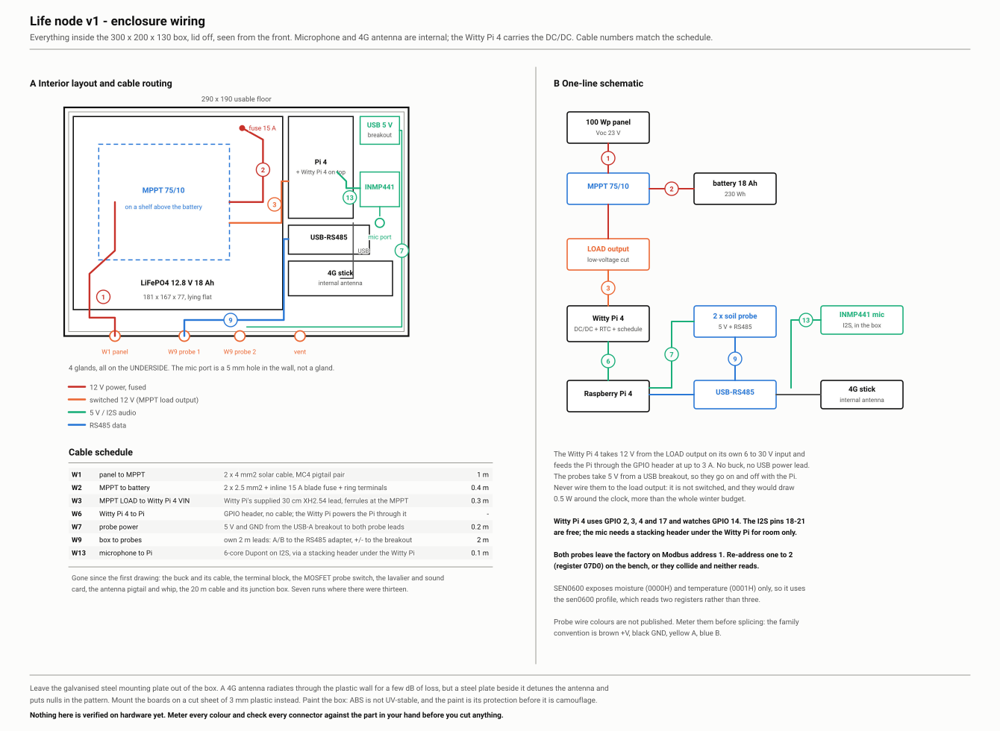

## Wire the power, battery before panel

In the field there is no socket. The panel charges the battery, the blue Victron charge controller looks after the battery, and the Witty Pi takes its power from the controller.

1. Switch off and unplug the wall supply from the Witty Pi.
2. Two wires from the controller's **LOAD +** and **LOAD −** to the Witty Pi's small white **6 to 30 V** connector. Red is plus.
3. The battery lead: the fuse holder goes in the red wire, **within a hand's width of the battery**. The fuse is not optional: a short circuit on a battery without one can start a fire.
4. Connect the battery lead to the controller's **BAT** terminals first, then to the battery: red to plus, black to minus.
5. Only now the panel, into the **PV** terminals. Indoors, lean it against a window; it gives a tenth of its power there, enough to see it charge.
6. Install the **VictronConnect** app on your phone, find the controller over Bluetooth, and choose the **LiFePO4** battery preset.

The probes keep their power from the Pi's USB port, so they are off whenever the Pi sleeps. Never connect them to the controller.

> **Check.** In the Victron app the battery shows a voltage above 12.8 V and, with the panel at the window, a small charging current. Tap the Witty Pi's button: the box starts.

## Let it run a day on its own

Leave the box on the desk for 24 hours without touching it. It wakes every hour, measures, sends, and sleeps.

Then pull the battery lead while the box is awake, wait a minute, and put it back. Do that three times. Each time the box must come back by itself at the next hour. Power that disappears in the middle of a sentence is the most likely thing to happen in a field; the box is built so that it loses nothing when it does.

> **Check.** On your box page, **The box is on** shows a time from the last hour, the soil lights carry fresh readings, and the Victron app shows the battery did not drop below 12.5 V overnight.
