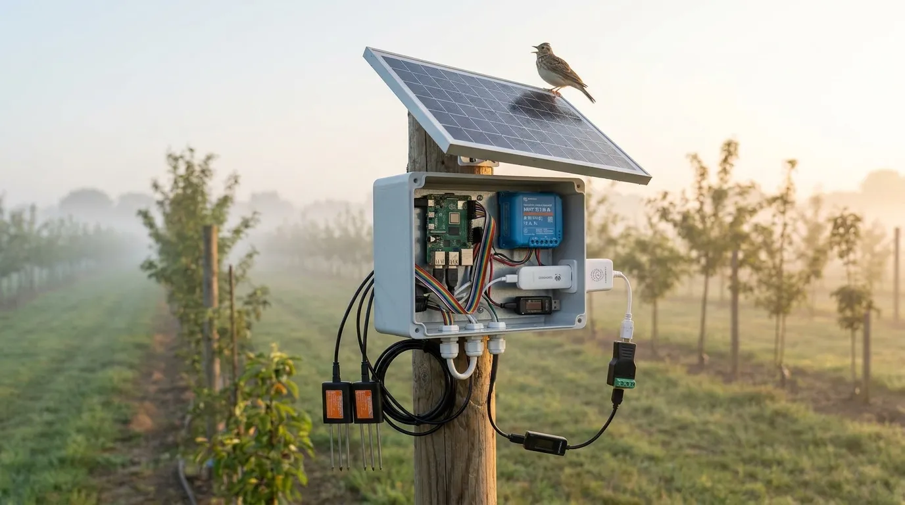

## Watch, do not touch

For two weeks, open your box page once a day and look at four things:

- **The box is on**: a time from today.
- **Microphone**: birds most mornings.
- **Soil probes**: both report. After rain the moisture goes up, then slowly down.
- **The battery**, in the Victron app when you pass by: above 12.5 V in the morning.

Do not open the box. Anything that needed a visit is worth knowing: write it in the feedback box at the bottom of this page, so the next builder does not run into it.

> **Check.** Fourteen days in which the box needed nothing from you. It now runs by itself.
