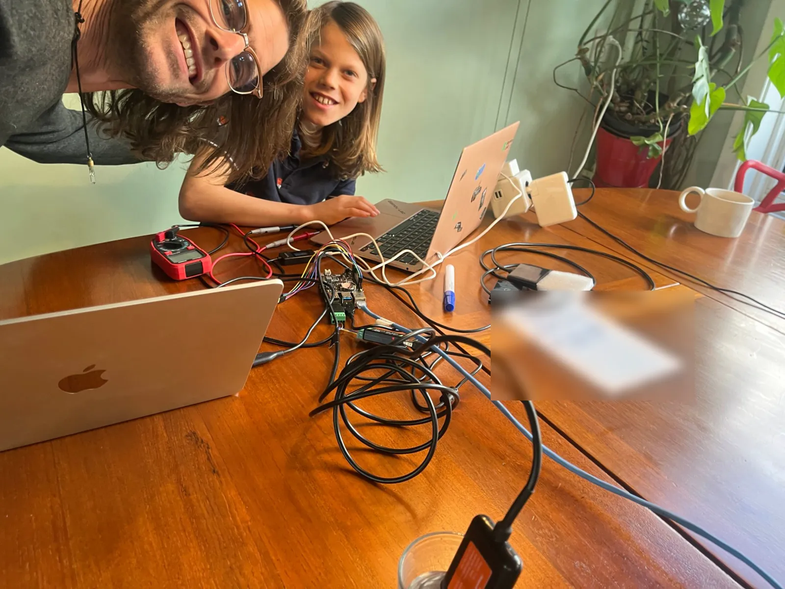
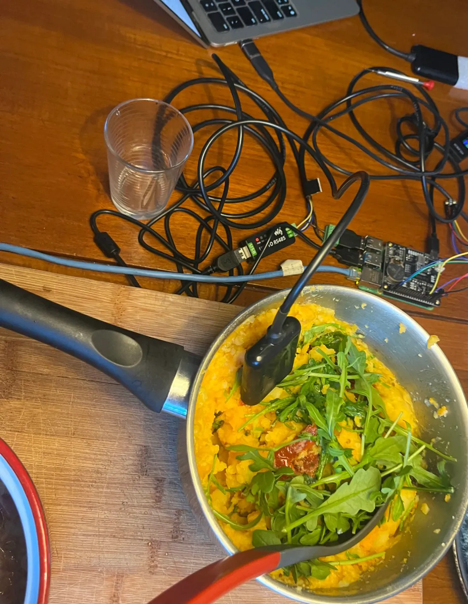
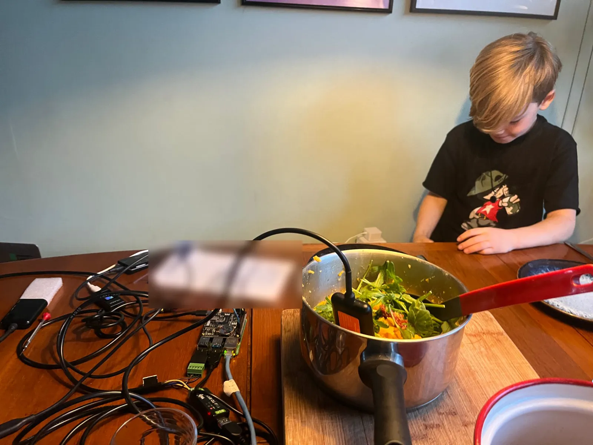
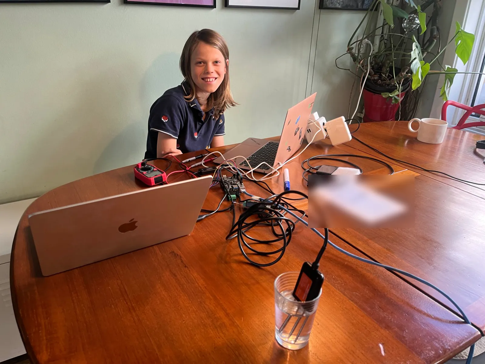

The [build guide](index.md) tells you what to do. This page tells you why it says that: every entry is something the first box, node 1, taught us on a desk, and what changed in the concept, the software or the plan as a result. Nothing here is modelled; it all happened. Numbers that were measured are also in [`kit/bench-log.csv`](https://github.com/oncra/life/blob/main/kit/bench-log.csv), next to what we had expected.

An entry is one of three kinds: a **learning** (something we now know), a **change** (something we did about it), or a **fun fact** (neither, but worth keeping).

## 10 October 2026

### The box now says how it is doing

*Change.* Until today the hourly message said that the box was alive and where it was, but not how it was. Now it also carries the battery, the temperature inside the box and how much power the computer draws. None of it needs a new part: the Witty Pi, the board that switches the computer on and off, already measures the voltage coming in from the charge controller, which is the battery's voltage less a few tenths, and it has a thermometer on board. When the charge controller's own cable is plugged in, the message also carries the solar panel's watts, the charge state and how much energy the panel gave today and yesterday. It is about 250 bytes on a message that is sent anyway, so it costs no extra connection and less than 2 % of the SIM's ten years. The box page shows it as three more lights, with the week's lowest and highest battery; a battery under 12.0 V sends a *low battery* warning, and 12.8 V clears it. On the desk the box runs on USB at 5 V, so its battery light stays grey until it is on the real battery.

## 9 October 2026

### A new name: Life Node

*Change.* The box was called the Life Box. That name is already registered as a trade mark by several companies, some of them for electronic devices, and a surgical-safety charity has used it for years. It is now the **Life Node**: one node of the Life Oracle, the system that learns from every node whether life is coming back. The guide moved from /lifebox to /node; old links still work.

### The first night on its own

*Learning.* After the desk tests the 30 cm probe went into a planter in the living room and the box was left alone. From 22:14 to 07:34 it took a reading every twenty minutes and sent them every hour: **29 readings out of 29**, nothing missing, nobody touching it. The soil went from **52.0 % to 49.3 %** moisture, by 0.9 in the first forty minutes after the probe went in and then about 0.2 an hour, and cooled from 19.5 to 18.8 °C. The second probe lay loose on the table and read the room: 0 % and 21.1 falling to 19.5 °C. The soil stayed cooler than the air and changed more slowly, which is what soil does. The 52 % itself is for potting compost, which holds far more water than a field does; in a planter the change is the reading to trust, not the level.

## 8 October 2026

### Dinner is 60 °C

*Fun fact.* The 30 cm soil probe had just passed its test in a glass of water when dinner arrived on the same table. So the probe went into the pan. It read **100 % moisture and 57 to 60 °C**, rising while we watched. The probe is rated to 80 °C, so mash is within specification.

The serious half of that hour: the same probe read **0.0 % in air, 100.0 % in water** and climbed from 20 to 26 °C in a warm hand. The way the node turns the probe's raw numbers into moisture and temperature had been written from the datasheet and had never met a real probe. It holds at both ends. ([#50](https://github.com/oncra/life/pull/50))

### The first list of birds: 22 species in twelve minutes

*Learning.* We played field recordings from a phone next to the microphone, one species after another. The box named **22 species in 31 detections**, 20 of them with a confidence of 90 % or more: robin, blue tit, great tit, goldfinch, blackbird, willow warbler, song thrush, house sparrow, wren, chiffchaff, chaffinch, brambling, blackcap, garden warbler, woodlark, tree pipit, common redstart, sedge warbler, linnet, stonechat, greenfinch and white wagtail. It kept apart the pairs that people confuse: willow warbler and chiffchaff, blackcap and garden warbler. The detections go to the oracle with the box's hourly message. ([#53](https://github.com/oncra/life/pull/53))

### The coin cell will outlive the box

*Learning.* The Witty Pi keeps its clock running on a CR2032 coin cell when it has no power. Would that cell last the ten years we want from a box? UUGear's manual gives the clock chip a draw of about 0.22 µA. A CR2032 holds about 225 mAh, so on paper that is **more than a hundred years**. And the clock only draws from the cell while the Witty Pi has no supply at all, which in a box with a battery is a few days a year. The cell's own shelf life, about ten years, is the limit, not the load. The coin cell is not what bounds the ten-year target. We replace it at a major service anyway, because it costs less than a euro and the box cannot measure it.

One caution we keep: the same manual says "about 4 µA" in another chapter. Even at that figure the cell would run the clock for six years without any supply, which a box never asks of it.

### The box draws about half of what we modelled

*Learning.* Every energy number in the kit rested on "about 5 W while awake". Measured on node 1 with the microphone listening and both probes connected: **2.75 W in a quiet room, about 3.5 W while birds sing without a pause**. Recognising birds costs power only when there is something to recognise, so a dawn chorus is about 0.75 W dearer than silence. The modelled 5 W stays in the tables until the 4G stick and the evening's bat model have been measured too; after that the battery and the panel can probably shrink. ([#51](https://github.com/oncra/life/pull/51), [#55](https://github.com/oncra/life/pull/55))

*Learning.* The Witty Pi's own sensors read 2.82 W where the meter read 2.75 W. They agree within 3 %, so a box can log its own power draw in the field, with nobody standing at a meter.

### Off now means off: 0.0 W

*Change.* When the box shut down, the Witty Pi was supposed to cut the power. It did not: the Pi sat there "off" and drew 1.1 to 1.8 W, more in one night than the whole winter budget of a day. Three things were missing, all of them in the image and none visible from outside: the Witty Pi watches one specific serial pin to see that the Pi has stopped, the Pi was not driving that pin, and the Witty Pi only starts watching after a signal that its own software sends, which could not run because one small program was not installed. With all three in place the meter read **0.0 W** seven seconds after a shutdown. ([#17](https://github.com/oncra/life/pull/17), [#45](https://github.com/oncra/life/pull/45))

*Change.* A Witty Pi fresh from the factory waits for a press on its button before it starts the Pi. A box whose battery ran flat in a dark week would then stay off until someone walked into the field. The image now sets the board to start the Pi as soon as power arrives.

### The power wire goes in +, not in S

*Change.* The first probe said nothing, at any speed. Its brown wire sat in the screw marked **S** of the USB screw terminal. S is the cable's shield, not power; the probe had no supply. Our drawing called the screws VCC and GND, which the part in the kit does not. The drawing and the step now show the five screws as they are marked, **S, +, D−, D+, −**, and name S as the first thing to check when a probe stays silent. ([#47](https://github.com/oncra/life/pull/47))

### Talking costs birds, and a zero deserves a second look

*Learning.* The box throws away every few seconds of sound in which it hears a human voice, birds included. That is how it keeps the promise that it never records people. On a desk it costs detections: three minutes with people talking gave 7 detections, the next three minutes in silence gave 14. The guide now asks for a quiet room and a recording without a narrator. ([#52](https://github.com/oncra/life/pull/52), [#53](https://github.com/oncra/life/pull/53))

*Learning.* For an hour we believed the box had heard nothing at all, and wrote that into the guide. It had heard 23 birds. The program we used to watch it asked the same question every five seconds and kept getting the first answer back from a cache. The guide was corrected the same evening. What we keep from it: before explaining a zero, ask once more in a different way. ([#54](https://github.com/oncra/life/pull/54))

### A tested image, for everyone

*Change.* The image that anyone can download had never started on a Raspberry Pi; the first public one, of 29 September, could not. Since today the public download and the per-box images at [life.oncra.org/box](https://life.oncra.org/box) are the image that node 1 runs: it starts by itself, sets its clock, hears the microphone, reads the probes, reports to the oracle and switches off properly. ([release image-v2](https://github.com/oncra/life/releases/tag/image-v2))

*Change.* A box on a desk should stay on while you wire it. `SCHEDULE=none` does that; before, the desk schedule switched the box off 45 minutes in every hour. ([#46](https://github.com/oncra/life/pull/46))

## 7 October 2026

### The clock comes first

*Change.* A new box shut itself down one minute after its first start. The Witty Pi's clock had never been set, the Pi copied that wrong time at startup, and the Witty Pi's own software then switched off the Pi's time synchronisation, so the wrong time stayed. A schedule computed from it said "time to sleep". Now the box first gets the right time and writes it into the Witty Pi, and only then computes a schedule. With no trustworthy time it plans no shutdown, stays on and tries again. ([#43](https://github.com/oncra/life/pull/43))

### Awake when the birds are, not when the clock says

*Change.* The summer schedule was ten hours from five in the morning, the same in March and in June. It now follows the sun at the box's own place: eight hours from civil dawn and two hours from sunset, so the dawn chorus, the evening chorus and the first hours of the bats all fall inside a window. ([#43](https://github.com/oncra/life/pull/43))

### A second listener, and the bats

*Change.* Perch v2 now runs beside BirdNET on the box, and every detection says which model made it. The kit gained a design for hearing bats, with the energy it would cost calculated before any part is bought. ([#42](https://github.com/oncra/life/pull/42), [#44](https://github.com/oncra/life/pull/44))

## 5 October 2026

### A microphone that is wired wrong is perfectly silent

*Learning.* We expected a badly wired microphone to hiss. It gives exactly nothing: every sample is zero. The Pi shows a sound card either way, because the sound card comes from a setting and not from the microphone. So "the Pi sees a microphone" proves nothing; only a signal does.

### The box was listening to a microphone that does not exist

*Change.* With the wiring right, sound arrived and still no bird was named. The bird recogniser had been told to listen to a device called `sysdefault`, which on a box does not exist. It reported no error and analysed silence. Pointed at the real microphone, it named a **blackbird at 96 %** within half a minute: the first bird a Life Node ever heard. ([#41](https://github.com/oncra/life/pull/41))

*Change.* The blackbird then stayed on the box. The program that sends detections to the oracle did not understand the recogniser's current database, stopped, and took the hourly "I am alive" message down with it. Both go out now. ([#41](https://github.com/oncra/life/pull/41))

### An empty card looks like a broken Pi

*Learning.* A steady green light and nothing on the network: the files the Pi starts from had been dragged to the bin on a laptop. A steady green light means the Pi found nothing to start from. Look at the card before suspecting the Pi.

## 1 October 2026

### One page, no terminal

*Change.* The plan was six pages of stages, written for someone with a command line. It became one page of plain steps from ordering to the field, each with a check you can see as a light on your own box page. You name your box, give the WiFi and download a card image made for it, so nobody types a password or a token into a file. ([#20](https://github.com/oncra/life/pull/20), [#28](https://github.com/oncra/life/pull/28))

*Change.* Both soil probes leave the factory with the same address. The plan had a person typing commands to change one. Now the box does it: connect one probe alone, and the first time the box sees a single probe it gives that probe the second address by itself.

## 30 September 2026

### The first start, and four faults nobody could have seen on a workstation

*Learning.* The image had been built and inspected on a workstation, never started on a Pi. On the Pi it hung with one red light. The build had given the card a new identity while the startup file still asked for the old one, so the Pi waited for a disk that was not there. Once past that, three more faults showed, each invisible until the box ran: trailing comments in the settings file were read as part of the values, the bird recogniser's settings had been written to a place the running box hides, and WiFi stayed off because the base system ships with the radio disabled. An image is not finished until it has started on the real thing. ([#15](https://github.com/oncra/life/pull/15))

### A Pi that is "off" is not off

*Learning.* A Raspberry Pi 4 that has shut down while its supply stays connected draws **1.8 W**, more than it draws idle. Nothing in the kit's energy tables had counted on that. It is the reason the Witty Pi has to sit in the supply line and really cut the power, which took until 8 October to get right.

## 24 and 25 September 2026

### Theft and tampering became software

*Change.* The first idea against theft was a coin-cell tracker in the box. Instead the box reports, with every hourly message, which mobile cell it is in. The oracle remembers the first one as home, raises an alert when a box reports from elsewhere, and another when a box that had been heard falls silent for 36 hours. No extra part, nothing that beeps. A small guard board with a siren covers the lid and the panel, and stays quiet only inside a maintenance window that the owner opens. ([node README](https://github.com/oncra/life/blob/main/node/README.md))

### A smaller battery

*Change.* Simulating the sun on an unshaded panel, hour by hour, showed that a 40 to 50 W panel with a 10 Ah battery is enough on open ground. The kit had assumed 100 W and 20 Ah. The measurements of 8 October point the same way.
